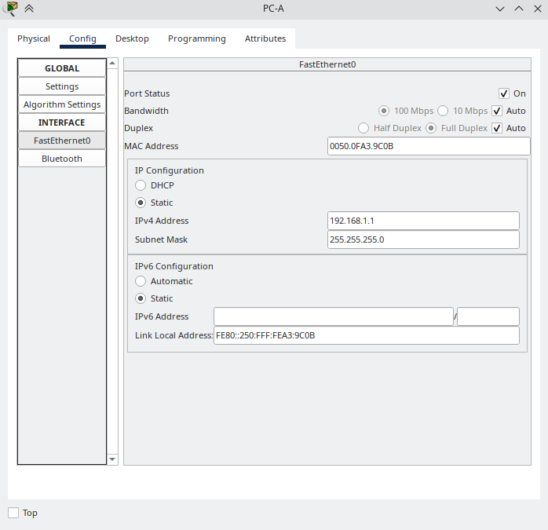

# Просмотр таблицы MAC-адресов коммутатора

## Исходные данные
### Топология


### Таблица адресации
| Устройство | Интерфейс | IP-адрес     | Маска подсети |
|------------|-----------|--------------|---------------|
| S1         | VLAN1     | 192.168.1.11 | 255.255.255.0 |
| S2         | VLAN1     | 192.168.1.12 | 255.255.255.0 |
| PC-A       | NIC       | 192.168.1.1  | 255.255.255.0 |
| PC-B       | NIC       | 192.168.1.2  | 255.255.255.0 |

## Часть 1. Создание и настройка сети.
  <details><summary>Шаг 1. Подключена сеть в соответствии с топологией.</summary>
      
 
 
 </details>

  <details><summary>Шаг 2. Настроены сетевые параметры ПК.</summary>
      
   
 
 </details>

<details><summary>Шаг 3. Выполнена инициализация и перезагрузка коммутаторов.</summary>
      
 
 
 </details>
Шаг 4. Настроены базовые параметры каждого коммутатора.

*Для уменьшения объема текста далее, в случае аналогичных настроек, будут приводиться настройки для коммутатора S1. В комментариях будут указываться параметры для S2.*

 1. Настроены имена устройств в соответствии с топологией:
```
Switch> enable
Switch# conf t
Switch(config)# hostname S1 //Для второго коммутатора указать имя S2
```
2. Настроены IP-адреса, как указано в таблице адресации:
```
S1(config)# int vlan 1
S1(config-if)# ip address 192.168.1.11 255.255.255.0 //Для S2 указать ip-адрес 192.168.1.12
S1(config-if)# no shutdown
S1(config-if)# exit
```
3. Назначен пароль для консоли и VTY:
```
S1(config)# service password-encryption
S1(config)# line console 0
S1(config-line)# logging synchronous 
S1(config-line)# password cisco 
S1(config-line)# login 
S1(config-line)# exit
```
4. Назначен пароль для доступа к привилегированному режиму EXEC:
```
S1(config)# enable secret class
S1(config)# exit
```

## Часть 2. Изучение таблицы MAC-адресов коммутатора.

Шаг 1. Определены MAC-адреса сетевых устройств.

| Устройство | MAC-адрес      |
|------------|:--------------:|
| S1 (F0/1)  | 0000.0C24.7D01 |
| S2 (F0/1)  | 0001.C9B7.BE01 |
| PC-A       | 0050.0FA3.9C0B |
| PC-B       | 0090.2BB4.5E79 |

Шаг 2. Просмотр таблицы MAC-адресов коммутатора.

В таблице MAC-адресов коммутатора S2 присутствует только одна запись. Данный MAC-адрес принадлежит порту коммутатора S1, подключенному к порту F0/1.
В случае, если заранее не известно каким устройствам принадлежат MAC-адреса в выводе команды *show mac address-table*, можно ориентироваться по портам, на которых обнаруживается этот MAC-адрес. 
Так как заранее известно, что порт F0/1 соединен с коммутатором S1, можно точно сказать, что MAC-адрес принадлежит коммутатору S1. В случае, если коммутация неизвестна, определение соответствия MAC-адреса сетевому устройству может быть затруднительна.

Шаг 3. Очистка таблицы MAC-адресов коммутатора S2.
С помощью команды *clear mac address-table dynamic* очищена таблица MAC-адресов. Сразу после выполнения команды таблица оказывается пустой, через некоторое время в ней снова появляется MAC-адрес коммутатора S1.

Шаг 4. Отправка эхо-запросов с PC-B и проверка таблицы MAC-адресов.
1. Команда arp -a, выполненная на компьютере PC-B, возвращает ответ, что отсутствуют записи ARP.
2. Из командной строки PC-B отправлены эхо-запросы на компьютер PC-A и оба коммутатора. Ответы получены от всех устройств.
3. Получена таблица MAC-адресов коммутатора S2.

В таблице появились новые MAC-адреса:
- MAC-адрес PC-A, подключенного через коммутатор S1. Он отображается подключенным к порту Fa0/1 коммутатора S2, так как через него происходит взаимодействие с коммутатором S1.
- MAC-адрес PC-B, который подключен к порту Fa0/18 коммутатора S2.
- MAC-адрес интерфейса VLAN1 на коммутаторе S1.

После этого получен ARP-кэш компьютера PC-B.

Можно убедиться, что в ARP-кэше появились записи для всех сетевых устройств, к которым были отправлены эхо-запросы.

В крупных сетях широковещательные рассылки ARP могут вызывать широковещательные штормы.

