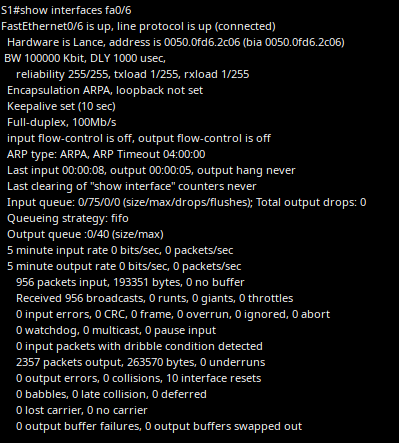
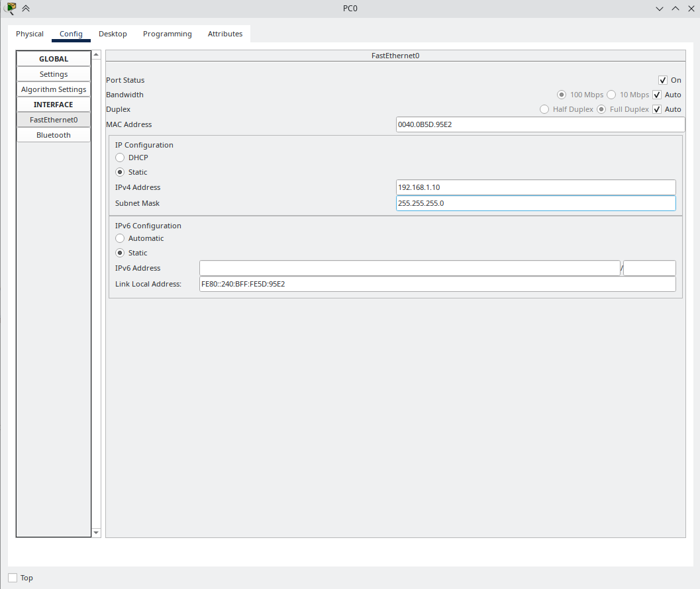
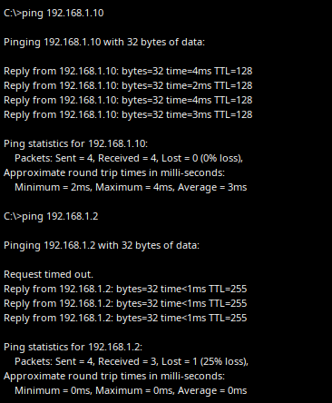
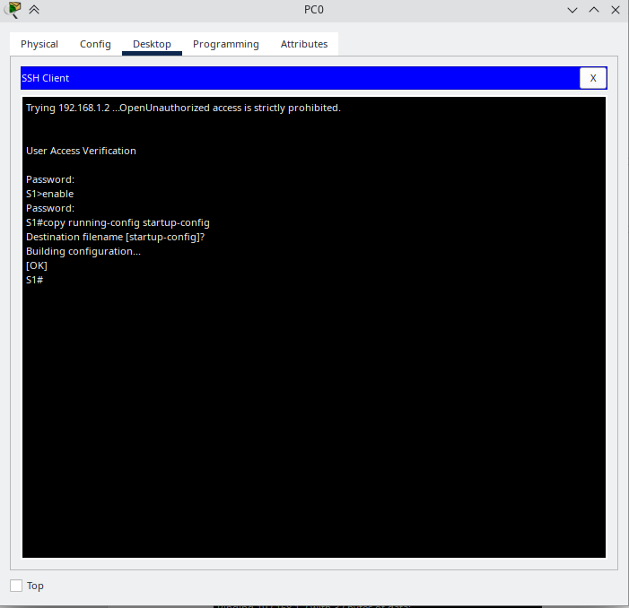

# Базовая настройка коммутатора

## Исходные данные
### Топология


### Таблица адресации

| Устройство | Интерфейс | IP-адрес / префикс |
|------------|-----------|--------------------|
| S1         | VLAN1     | 192.168.1.2 / 24   |
| PC-A       | NIC       | 192.168.1.10 / 24  |


## Часть 1. Проверка конфигурации коммутатора по умолчанию

| Параметр                      | Значение                        |
|-------------------------------|---------------------------------|
| running config                | по умолчанию                    |
| Интерфейсов FastEthernet      | 24                              |
| Интерфейсов GigabitEthernet   | 2                               |
| IP-адрес интерфейса SVI       | отсутствует                     |
| MAC-адрес интерфейса SVI      | 00D0FF12E841                    |
| Состояние интерфейса SVI      | выключен                        |
| Версия ОС Cisco IOS           | 15.0(2)SE4 релиз fc1            |
| Файл образа системы           | 2960-lanbasek9-mz.150-2.SE4.bin |
| Базовый MAC-адрес коммутатора | 00D0FF12E841                    |

Рассмотрим свойства интерфейса FastEthernet 0/6, назначенные по умолчанию.


Интерфейс изначально находится в выключенном состоянии и включается при подключении к нему компьютера.
MAC-адрес интерфейса 0050.0fd6.2c06.
Интерфейс работает в полном дуплексе со скоростью 100Мб/с.

Рассмотрим параметры VLAN 1.
| Параметр            | Значение          |
|---------------------|-------------------|
| Имя                 | default           |
| Порты в сети VLAN 1 | fa0/1-24, gi0/1-2 |
| Статус сети         | активна           |
| Тип сети            | нетегированная    |

## Часть 2. Настройка базовых параметров сетевых устройств
### Настройка параметров коммутатора
Перейдем в режим глобальной конфигурации и выполним настройку базовых параметров.
```
Switch> enable
Switch# conf t
Switch(config)# no ip domain-lookup //отключаем разрешение имен в терминале
Switch(config)# hostname S1 //назначаем имя коммутатору
S1(config)# service password-encryption //включаем шифрование паролей
S1(config)# enable secret class //назначаем пароль для административного режима
S1(config)# banner motd "Unauthorized access is strictly prohibited" //Задаем банер, который будет отображаться при входе
```
Назначим ip-адрес для удаленного управления коммутатором.
```
S1(config)# int vlan 1
S1(config-if)# ip address 192.168.1.2 255.255.255.0 //назначаем ip-адрес и маску
S1(config-if)# no shutdown //включаем интерфейс
S1(config-if)# exit
```
Ограничим доступ к консоли с помощью пароля.
```
S1(config)# line console 0
S1(config-line)# logging synchronous //изменяем режим вывода консольных сообщений
S1(config-line)# password cisco //назначаем пароль для доступа к консоли
S1(config-line)# login //включаем запрос пароля при входе
S1(config-line)# end
```
Ограничим доступ к vty0-15 с помощью пароля.
```
S1(config)# line vty 0 15
S1(config-line)# password cisco //назначаем пароль для доступа
S1(config-line)# login //включаем запрос пароля при входе
S1(config-line)# end
```
### Настройка параметров компьютера


## Часть 3. Проверка сетевых подключений.
### Конфигурация коммутатора.
```
S1# show run
Building configuration...
Current configuration : 1316 bytes
!
version 15.0
no service timestamps log datetime msec
no service timestamps debug datetime msec
service password-encryption
!
hostname S1
!
enable secret 5 $1$mERr$9cTjUIEqNGurQiFU.ZeCi1
!
!
!
no ip domain-lookup
!
!
!
spanning-tree mode pvst
spanning-tree extend system-id
!
interface FastEthernet0/1
!
interface FastEthernet0/2
!
interface FastEthernet0/3
!
---------------------------------------------------------------
interface FastEthernet0/24
!
interface GigabitEthernet0/1
!
interface GigabitEthernet0/2
!
interface Vlan1
ip address 192.168.1.2 255.255.255.0
!
banner motd ^CUnauthorized access is strictly prohibited.^C
!
!
!
line con 0
password 7 0822455D0A16
logging synchronous
login
!
line vty 0 4
password 7 0822455D0A16
login
line vty 5 15
password 7 0822455D0A16
login
!
!
!
!
end
```
Посмотрим параметры vlan1.
```
S1# show int vlan 1
Vlan1 is up, line protocol is up
Hardware is CPU Interface, address is 00d0.ff12.e841 (bia 00d0.ff12.e841)
Internet address is 192.168.1.2/24
MTU 1500 bytes, BW 100000 Kbit, DLY 1000000 usec,
reliability 255/255, txload 1/255, rxload 1/255
Encapsulation ARPA, loopback not set
ARP type: ARPA, ARP Timeout 04:00:00
Last input 21:40:21, output never, output hang never
Last clearing of "show interface" counters never
Input queue: 0/75/0/0 (size/max/drops/flushes); Total output drops: 0
Queueing strategy: fifo
Output queue: 0/40 (size/max)
5 minute input rate 0 bits/sec, 0 packets/sec
5 minute output rate 0 bits/sec, 0 packets/sec
1682 packets input, 530955 bytes, 0 no buffer
Received 0 broadcasts (0 IP multicast)
0 runts, 0 giants, 0 throttles
0 input errors, 0 CRC, 0 frame, 0 overrun, 0 ignored
563859 packets output, 0 bytes, 0 underruns
0 output errors, 23 interface resets
0 output buffer failures, 0 output buffers swapped out
```
Полоса пропускания интерфейса - 100000 Kbit.
VLAN 1 включен, канальный протокол включен.

### Проверка соединения.


### Проверка удаленного управления коммутатором


## Ответы на вопросы
1. Без настройки пароля VTY невозможно будет подключиться через telnet.
2. Для того, чтобы пароли не отправлялись в незашифрованном виде по сети, необходимо использовать ssh.
