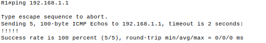
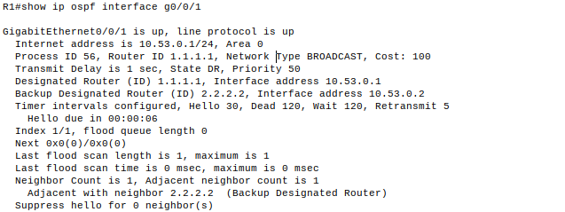

# Настройка протокола OSPFv2 для одной области.

## Топология.


## Таблица адресации

<table>
    <thead>
        <tr>
            <th>Устройство</th>
            <th>Интерфейс/VLAN</th>
            <th>IP-адрес</th>
            <th>Маска подсети</th>
        </tr>
    </thead>
    <tbody>
        <tr>
            <td rowspan=2 align="center">R1</td>
            <td align="center">G0/0/1</td>
            <td align="center">10.53.0.1</td>
            <td align="center">255.255.255.0</td>
        </tr>
        <tr>
            <td align="center">Loopback 1</td>
            <td align="center">172.16.1.1</td>
            <td align="center">255.255.255.0</td>
        </tr>
        <tr>
            <td rowspan=2 align="center">R2</td>
            <td align="center">G0/0/1</td>
            <td align="center">10.53.0.2</td>
            <td align="center">255.255.255.0</td>
        </tr>
        <tr>
            <td align="center">Loopback 1</td>
            <td align="center">192.168.1.1</td>
            <td align="center">255.255.255.0</td>
        </tr>
    </tbody>
</table>

## Создание сети и настройка основных параметров устройства.

### Базовая настройка маршрутизаторов.

Настройка выполнена скриптами. Для R1:
```
enable
configure terminal
hostname R1
no ip domain lookup
service password-encryption
enable secret class
line console 0
logging synchronous
password cisco
login
exit
line vty 0 4
logging synchronous
password cisco
login
exit
banner motd "Please login"
exit
wr

```
Для R2:
```
enable
configure terminal
hostname R2
no ip domain lookup
service password-encryption
enable secret class
line console 0
logging synchronous
password cisco
login
exit
line vty 0 4
logging synchronous
password cisco
login
exit
banner motd "Please login"
exit
wr

```

### Настройка базовых параметров коммутаторов.
Настройка выполнена скриптами. Для S1:
```
enable
configure terminal
hostname S1
no ip domain lookup
service password-encryption
enable secret class
line console 0
logging synchronous
password cisco
login
exit
line vty 0 4
logging synchronous
password cisco
login
exit
banner motd "Please login"
exit
wr
```
Для S2:
```
enable
configure terminal
hostname S2
no ip domain lookup
service password-encryption
enable secret class
line console 0
logging synchronous
password cisco
login
exit
line vty 0 4
logging synchronous
password cisco
login
exit
banner motd "Please login"
exit
wr
```

## Настройка и проверка базовой работы протокола OSPFv2 для одной области.

### Настройка адресов интерфейса и базового OSPFv2 для одной области.

Настройка адресов интерфейсов на каждом маршрутизаторе.
R1:
```
R1(config)#interface Loopback 1
R1(config-if)#ip address 172.16.1.1 255.255.255.0
R1(config)#int g0/0/1
R1(config-if)#ip address 10.53.0.1 255.255.255.0
R1(config-if)#no shut
```

R2:
```
R2(config)#int Loopback 1
R2(config-if)#ip address 192.168.1.1 255.255.255.0
R2(config-if)#int g0/0/1
R2(config-if)#ip address 10.53.0.2 255.255.255.0
R2(config-if)#no shut
```

Настройка статических идентификаторов маршрутизаторов.
R1:
```
R1(config)#router ospf 56
R1(config-router)#router-id 1.1.1.1
R1(config-router)#network 10.53.0.0 0.0.0.255 area 0
```
R2:
```
R2(config)#router ospf 56
R2(config-router)#router-id 2.2.2.2
R2(config-router)#network 10.53.0.0 0.0.0.255 area 0
R2(config-router)#network 192.168.1.0 0.0.0.255 area 0
```
Проверка работы OSPF.
R1:
```
R1#show ip ospf neighbor
Neighbor ID     Pri   State           Dead Time   Address         Interface
2.2.2.2           1   FULL/BDR        00:00:36    10.53.0.2       GigabitEthernet0/0/1
```
R2:
```
R2#show ip ospf neighbor 
Neighbor ID     Pri   State           Dead Time   Address         Interface
1.1.1.1           1   FULL/DR         00:00:30    10.53.0.1       GigabitEthernet0/0/1
```

DR является R2. R1 является BDR. Маршрутизатор с наибольшим идентификатором используется при выборе DR и BDR.

```
R1#show ip route ospf
     192.168.1.0/32 is subnetted, 1 subnets
O       192.168.1.1 [110/2] via 10.53.0.2, 00:15:20, GigabitEthernet0/0/1
```
Проверка доступности Loopback 1 интерфейса R2 с R1.


## Оптимизация и проверка конфигурации OSPFv2 для одной области.

На R1 настроен приоритет OSPF 50 для интерфейса G0/0/1 и настроен таймер приветствия.
```
R1(config)#int g0/0/1
R1(config-if)#ip ospf priority 50
R1(config-if)#ip ospf hello-interval 30
```
Для R2 настроен таймер приветствия.
```
R2(config)#int g0/0/1
R2(config-if)#ip ospf hello-interval 30
```

На R1 настроен статический маршрут по умолчанию, который использует интерфейс Loopback 1 в качестве интерфейса выхода.
```
R1(config)#ip route 0.0.0.0 0.0.0.0 Loopback 1
%Default route without gateway, if not a point-to-point interface, may impact performance
R1(config)#router ospf 56
R1(config-router)#default-information originate 
```

Добавлена конфигурацию, необходимая OSPF для обработки R2 Loopback 1 как сети точка-точка.
```
R2(config)#int Loopback 1
R2(config-if)#ip ospf network point-to-point
```

На R2 добавлена конфигурация, необходимую для предотвращения отправки объявлений OSPF в сеть Loopback 1.
```
R2(config)#router ospf 56
R2(config-router)#passive-interface loopback 1
```

```
R1(config)#router ospf 56
R1(config-router)#auto-cost reference-bandwidth 1000
% OSPF: Reference bandwidth is changed.
        Please ensure reference bandwidth is consistent across all routers.
R1#clear ip ospf process 
Reset ALL OSPF processes? [no]: yes

R1#
00:27:29: %OSPF-5-ADJCHG: Process 56, Nbr 2.2.2.2 on GigabitEthernet0/0/1 from FULL to DOWN, Neighbor Down: Adjacency forced to reset

00:27:29: %OSPF-5-ADJCHG: Process 56, Nbr 2.2.2.2 on GigabitEthernet0/0/1 from FULL to DOWN, Neighbor Down: Interface down or detached

R1#
00:27:30: %OSPF-5-ADJCHG: Process 56, Nbr 2.2.2.2 on GigabitEthernet0/0/1 from LOADING to FULL, Loading Done
```

```
R2(config)#router ospf 56
R2(config-router)#auto-cost reference-bandwidth 1000
% OSPF: Reference bandwidth is changed.
        Please ensure reference bandwidth is consistent across all routers.
R2#clear ip ospf process 
Reset ALL OSPF processes? [no]: yes

00:13:29: %OSPF-5-ADJCHG: Process 56, Nbr 1.1.1.1 on GigabitEthernet0/0/1 from FULL to DOWN, Neighbor Down: Adjacency forced to reset

00:13:29: %OSPF-5-ADJCHG: Process 56, Nbr 1.1.1.1 on GigabitEthernet0/0/1 from FULL to DOWN, Neighbor Down: Interface down or detached

R2(config-router)#
00:13:37: %OSPF-5-ADJCHG: Process 56, Nbr 1.1.1.1 on GigabitEthernet0/0/1 from LOADING to FULL, Loading Done
```

Проверка оптимизации OSPFv2.



Почему стоимость OSPF для маршрута по умолчанию отличается от стоимости OSPF в R1 для сети 192.168.1.0/24?

Показатель для маршрута по умолчанию был равен 1, поэтому он имеет значение 1 везде в сети OSPF 56. 
Сеть 192.168.1.0 /24 является внутренним маршрутом OSPF, показатель которого вычисляется.