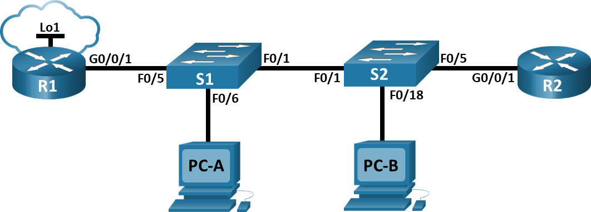
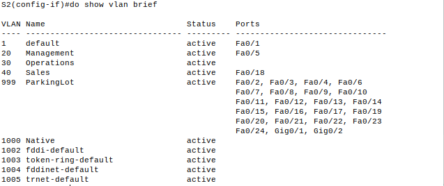
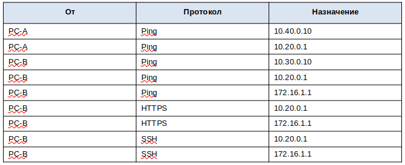
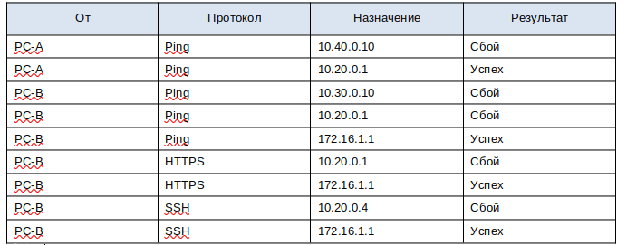

# Настройка и проверка расширенных списков контроля доступа.

## Топология.


# Таблица адресации.
<table>
    <thead>
        <tr>
            <th>Устройство</th>
            <th>Интерфейс/VLAN</th>
            <th>IP-адрес</th>
            <th>Маска подсети</th>
            <th>Шлюз по умолчанию</th>
        </tr>
    </thead>
    <tbody>
        <tr>
            <td rowspan=6 align="center">R1</td>
            <td align="center">G0/0/1</td>
            <td align="center">-</td>
            <td align="center">-</td>
            <td align="center">-</td>
        </tr>
        <tr>
            <td align="center">G0/0/1.20 </td>
            <td align="center">10.20.0.1</td>
            <td align="center">255.255.255.0</td>
            <td align="center"></td>
        </tr>
        <tr>
            <td align="center">G0/0/1.30</td>
            <td align="center">10.30.0.1</td>
            <td align="center">255.255.255.0</td>
            <td align="center"></td>
        </tr>
        <tr>
            <td align="center">G0/0/1.40</td>
            <td align="center">10.40.0.1</td>
            <td align="center">255.255.255.0</td>
            <td align="center"></td>
        </tr>
        <tr>
            <td align="center">G0/0/1.1000</td>
            <td align="center">-</td>
            <td align="center">-</td>
            <td align="center"></td>
        </tr>
        <tr>
            <td align="center">Loopback1</td>
            <td align="center">172.16.1.1</td>
            <td align="center">255.255.255.0</td>
            <td align="center"></td>
        </tr>
        <tr>
            <td align="center">R2</td>
            <td align="center">G0/0/1</td>
            <td align="center">10.20.0.4</td>
            <td align="center">255.255.255.0</td>
            <td align="center">-</td>
        </tr>
        <tr>
            <td align="center">S1</td>
            <td align="center">VLAN 20</td>
            <td align="center">10.20.0.2</td>
            <td align="center">255.255.255.0</td>
            <td align="center">10.20.0.1</td>
        </tr>
        <tr>
            <td align="center">S2</td>
            <td align="center">VLAN 20</td>
            <td align="center">10.20.0.3</td>
            <td align="center">255.255.255.0</td>
            <td align="center">10.20.0.1</td>
        </tr>
        <tr>
            <td align="center">PC-A</td>
            <td align="center">NIC</td>
            <td align="center">10.30.0.10</td>
            <td align="center">255.255.255.0</td>
            <td align="center">10.30.0.1</td>
        </tr>
        <tr>
            <td align="center">PC-B</td>
            <td align="center">NIC</td>
            <td align="center">10.40.0.10</td>
            <td align="center">255.255.255.0</td>
            <td align="center">10.40.0.1</td>
        </tr>
    </tbody>
</table>

## Таблица VLAN.

<table>
    <thead>
        <tr>
            <th>VLAN</th>
            <th>Имя</th>
            <th>Назначенный интерфейс</th>
        </tr>
    </thead>
    <tbody>
        <tr>
            <td align="center">20</td>
            <td align="center">Management</td>
            <td align="center">S2: F0/5</td>
        </tr>
        <tr>
            <td align="center">30</td>
            <td align="center">Operations</td>
            <td align="center">S1: F0/6</td>
        </tr>
        <tr>
            <td align="center">40</td>
            <td align="center">Sales</td>
            <td align="center">S2: F0/18</td>
        </tr>
        <tr>
            <td align="center">999</td>
            <td align="center">ParkingLot</td>
            <td align="center">S1: F0/2-4, F0/7-24, G0/1-2
S2: F0/2-4, F0/6-17, F0/19-24, G0/1-2</td>
        </tr>
        <tr>
            <td align="center">1000</td>
            <td align="center">Native</td>
            <td align="center">-</td>
        </tr>
    </tbody>
</table>

## Создание сети и настройка основных параметров устройства.

### Базовая настройка маршрутизаторов.

Настройка выполнена скриптами. Для R1:

```
enable
configure terminal
hostname R1
no ip domain lookup
service password-encryption
enable secret class
line console 0
logging synchronous
password cisco
login
exit
line vty 0 4
logging synchronous
password cisco
login
exit
banner motd "Please login"
exit
wr

```

Для R2:
```
enable
configure terminal
hostname R2
no ip domain lookup
service password-encryption
enable secret class
line console 0
logging synchronous
password cisco
login
exit
line vty 0 4
logging synchronous
password cisco
login
exit
banner motd "Please login"
exit
wr

```

### Базовая настройка коммутаторов.
Настройка выполнена скриптами. Для S1:
```
enable
configure terminal
hostname S1
no ip domain lookup
service password-encryption
enable secret class
line console 0
logging synchronous
password cisco
login
exit
line vty 0 4
logging synchronous
password cisco
login
exit
banner motd "Please login"
exit
wr
```
Для S2:
```
enable
configure terminal
hostname S2
no ip domain lookup
service password-encryption
enable secret class
line console 0
logging synchronous
password cisco
login
exit
line vty 0 4
logging synchronous
password cisco
login
exit
banner motd "Please login"
exit
wr
```

## Настройка сетей VLAN на коммутаторах.

Создание VLAN на коммутаторах. S1:
```
S1#conf t
S1(config)#vlan 20
S1(config-vlan)#name Management
S1(config-vlan)#vlan 30
S1(config-vlan)#name Operations
S1(config-vlan)#vlan 40
S1(config-vlan)#name Sales
S1(config-vlan)#vlan 999
S1(config-vlan)#name ParkingLot
S1(config-vlan)#vlan 1000
S1(config-vlan)#name Native
S1(config-vlan)#exit
```

S2:
```
S2#conf t
S2(config)#vlan 20
S2(config-vlan)#name Management
S2(config-vlan)#vlan 30
S2(config-vlan)#name Operations
S2(config-vlan)#vlan 40
S2(config-vlan)#name Sales
S2(config-vlan)#vlan 999
S2(config-vlan)#name ParkingLot
S2(config-vlan)#vlan 1000
S2(config-vlan)#name Native
S2(config-vlan)#exit
```

Настройка интерфейсов управления и шлюза по умолчанию. S1:
```
S1(config)#int vlan 20
S1(config-if)#ip address 10.20.0.2 255.255.255.0
S1(config-if)#exit
S1(config)#ip default-gateway 10.20.0.1
```

S2:
```
S2(config)#int vlan 20
S2(config-if)#ip address 10.20.0.3 255.255.255.0
S2(config-if)#exit
S2(config)#ip default-gateway 10.20.0.1
```

Назначение всем неиспользуемым портам коммутатора VLAN Parking Lot, настройка их для статического режима доступа.
```
S1(config)#int range F0/2-4, F0/7-24, g0/1-2
S1(config-if-range)#switchport mode access
S1(config-if-range)#switchport access vlan 999
S1(config-if-range)#shut
```

```
S2(config)#int range f0/2-4, f0/6-17, f0/18-24, g0/1-2
S2(config-if-range)#switchport mode access 
S2(config-if-range)#switchport access vlan 999
S2(config-if-range)#shut
```

Назначение сети VLAN соответствующим интерфейсам коммутатора.

```
S1(config)#int f0/6
S1(config-if)#switchport mode access 
S1(config-if)#switchport access vlan 30
```


```
S2(config)#int f0/5
S2(config-if)#switchport mode access 
S2(config-if)#switchport access vlan 20
S2(config-if)#int f0/18
S2(config-if)#switchport mode access
S2(config-if)#switchport access vlan 40
```


## Настройка магистральных каналов.
### Настройка интерфейса F0/1.
```
S1(config)#int f0/1
S1(config-if)#switchport mode trunk
S1(config-if)#switchport trunk native vlan 1000
S1(config-if)#switchport trunk allowed vlan 20,30,40,1000
```

```
S2(config)#int f0/1
S2(config-if)#switchport mode trunk
S2(config-if)#switchport trunk native vlan 1000
S2(config-if)#switchport trunk allowed vlan 20,30,40,1000
```


### Настройка интерфейса F0/5 на коммутаторе S1.
```
S1(config)#int f0/5
S1(config-if)#switchport mode trunk 
S1(config-if)#switchport trunk native vlan 1000
S1(config-if)#switchport trunk allowed vlan 20,30,40,1000
S1(config-if)#exit
S1(config)#do wr
```

## Настройка маршрутизатора.
### Настройка маршрутизации между сетями VLAN на R1.

```
R1(config)#int g0/0/1
R1(config-if)#no shut
R1(config)#interface g0/0/1.20
R1(config-subif)#encapsulation dot1Q 20
R1(config-subif)#ip address 10.20.0.1 255.255.255.0
R1(config-subif)#description Management
R1(config-subif)#int g0/0/1.30
R1(config-subif)#encapsulation dot1Q 30
R1(config-subif)#ip address 10.30.0.1 255.255.255.0
R1(config-subif)#description Operations
R1(config-subif)#int g0/0/1.40
R1(config-subif)#encapsulation dot1Q 40
R1(config-subif)#ip address 10.40.0.1 255.255.255.0
R1(config-subif)#description Sales
R1(config-subif)#int g0/0/1.1000
R1(config-subif)#encapsulation dot1Q 1000
R1(config-subif)#description Native
R1(config-subif)#exit
R1(config)#int Loopback 1
R1(config-if)#ip address 172.16.1.1 255.255.255.0
```


### Настройка интерфейса g0/0/1 на R2.

```
R2(config)#int g0/0/1
R2(config-if)#ip address 10.20.0.4 255.255.255.0
R2(config-if)#no shut
R2(config)#ip route 0.0.0.0 0.0.0.0 10.20.0.1
```

## Настройка удаленного доступа.
### Настройка всех сетевых устройств для базовой поддержки SSH.
Настройка выполнена командами:
```
username SSHadmin secret $cisco123!
ip domain name ccna-lab.com
crypto key generate rsa
1024
line vty 0 4
login local
transport input ssh
exit
ip ssh version 2
```

### Включение защищенной веб-службы с проверкой подлинности на R1.
```
R1(config)# ip http secure-server 
R1(config)# ip http authentication local
```
Данные команды отсутствуют в CPT.

## Проверка подключения.

Все указанные проверки, за исключением https, успешны.

## Настройка и проверка списков контроля доступа (ACL).

```
R1(config)#access-list 101 deny tcp 10.40.0.0 0.0.0.255 10.20.0.0 0.0.0.255 eq 22
R1(config)#access-list 101 deny tcp 10.40.0.0 0.0.0.255 172.16.1.2 0.0.0.0 eq 80
R1(config)#access-list 101 deny tcp 10.40.0.0 0.0.0.255 172.16.1.2 0.0.0.0 eq 443
R1(config)#access-list 101 deny icmp 10.40.0.0 0.0.0.255 10.20.0.0 0.0.0.255 echo
R1(config)#access-list 101 deny icmp 10.40.0.0 0.0.0.255 10.30.0.0 0.0.0.255 echo
R1(config)#access-list 101 permit ip any any
R1(config)#access-list 101 remark For Sales
R1(config)#int g0/0/1.40
R1(config-subif)#ip access-group 101 in
R1(config)#access-list 102 remark For Operations
R1(config)#access-list 102 deny icmp 10.30.0.0 0.0.0.255 10.40.0.0 0.0.0.255 echo
R1(config)#access-list 102 permit ip any any 
R1(config)#int g0/0/1.30
R1(config-subif)#ip access-group 102 in
```

Выполнена проверка работы в соответствии с таблицой.


Результаты совпадают с приведенными в таблице, за исключением HTTPS, так как данная технология не поддерживается в CPT.