# Настройка IPv6-адресов на сетевых устройствах
## Исходные данные
### Топология


### Таблица адресации
| Устройство | Интерфейс | IPv6-адрес         | Длина префикса | Шлюз по умолчанию |
|:----------:|:---------:|:------------------:|:--------------:|:-----------------:|
| R1         | G0/0/0    | 2001:db8:acad:a::1 | 64             | —                 |
| ^^         | G0/0/1    | 2001:db8:acad:1::1 | 64             | —                 |
| S1         | VLAN 1    | 2001:db8:acad:1::b | 64             | —                 |
| PC-A       | NIC       | 2001:db8:acad:1::3 | 64             | fe80::1           |
| PC-B       | NIC       | 2001:db8:acad:a::3 | 64             | fe80::1           |


## Часть 1. Настройка топологии и конфигурация основных параметров маршрутизатора и коммутатора.

### Шаг 1. Настройка маршрутизатора.
Настроено имя маршрутизатора, с помощью пароля ограничен доступ к консоли.

### Шаг 2. Настройка коммутаторов.
Настроено имя маршрутизатора, с помощью пароля ограничен доступ к консоли.

## Часть 2. Ручная настройка IPv6-адресов.

### Шаг 1. Назначение IPv6-адреса интерфейсам Ethernet на R1.

- Настроен статический IPv6-адрес интерфейсам G0/0 и G0/1:
```
R1(config) interface GigabitEthernet 0/0
R1(config-if) ipv6 address 2001:db8:acad:a::1/64
R1(config-if) exit
R1(config) interface GigabitEthernet 0/1
R1(config-if) ipv6 address 2001:db8:acad:1::1/64
R1(config-if) exit
```
- Поверка назначения IPv6-адресов:

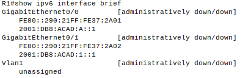
- Изменение link-local адреса портов:
```
R1(config) interface GigabitEthernet 0/0
R1(config-if) ipv6 address FE80::1 link-local
R1(config-if) no shutdown
R1(config-if) exit
R1(config) interface GigabitEthernet 0/1
R1(config-if) ipv6 address FE80::1 link-local
R1(config-if) no shutdown
R1(config-if) exit
```
- Поверка назначения IPv6-адресов:

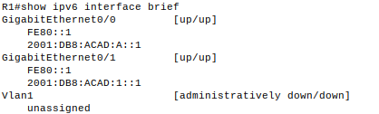

- Проверка назначения групп многоадресной рассылки для интерфейса GigabitEthernet 0/0.
 
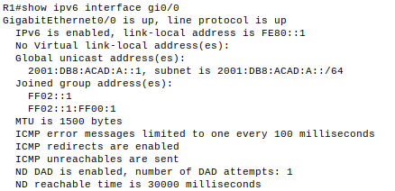

### Шаг 2. Активация IPv6 маршрутизации на R1.

- Проверка назначенного адреса компьютера PC-B:

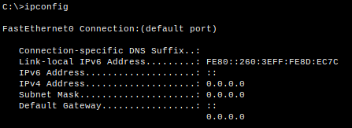

Видно, что индивидуальный адрес отсутствует.
- Активация маршрутизации на R1:
```
R1(config) ipv6 unicast-routing
```
- Проверка назначенного адреса компьютера PC-B:

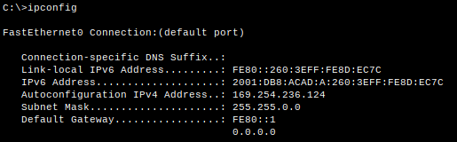

На R1 все интерфейсы IPv6 теперь являются частью многоадресной группы All-router, FF02\::2. Это позволяет маршрутизатору отправлять сообщения Router Advertisement (RA) с информацией о префиксе всем узлам в локальной сети. 

### Шаг 3. Назначение IPv6-адреса интерфейсу управления (SVI) на S1.

- Назначение адреса IPv6 для S1. Так же назначаем этому интерфейсу локальный адрес канала.
```
S1(config)# interface vlan 1
S1(config-if)# ipv6 address 2001:db8:acad:1::b/64
S1(config-if)# ipv6 address FE80::2 link-local
S1(config-if)# no shutdown
S1(config-if)# exit
```
Если не удается настроить ipv6 адрес, необходимо проверить включен ли протокол ipv6:
```
S1# show sdm prefer
```
Если выбран шаблон default, то необходимо изменить его на dual-ipv4-and-ipv6 или lanbase-routing.
```
S1(config)# sdm prefer dual-ipv4-and-ipv6 default
S1(config)# end
S1# reload
```
- Проверка правильности назначения IPv6 адресов.

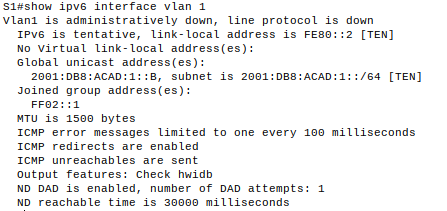

### Шаг 4. Назначение компьютерам статических IPv6-адресов.

Настройки сетевого интерфейса PC-A приведены на рисунке:

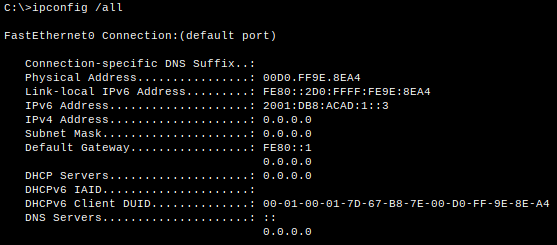

Настройки сетевого интерфейса PC-A приведены на рисунке:

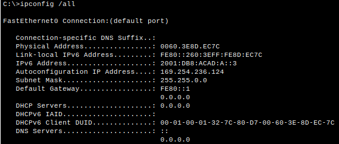

## Часть 3. Проверка сквозного подключения.

<details><summary>Эхо-запросы с PC-A на FE80::1 проходят.</summary>

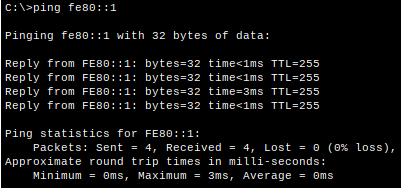

</details>

<details><summary>Эхо-запросы с PC-A на интерфейс управления S1 проходят.</summary>

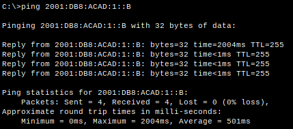

</details>

<details><summary>Трассировка с PC-A на до PC-B проходит.</summary>

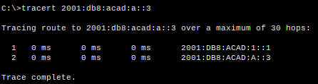

</details>

<details><summary>Эхо-запросы с PC-B на PC-B проходят.</summary>

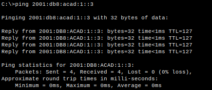

</details>

<details><summary>Эхо-запросы с PC-B на интерфейс G0/0 маршрутизатора R1 проходят.</summary>

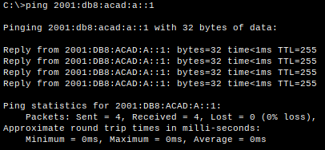

</details>

## Ответы на вопросы.

- Почему обоим интерфейсам Ethernet на R1 можно назначить один и тот же локальный адрес канала — FE80::1?

Обоим Ethernet-интерфесам на R1 можно назначить один и тот же адрес, потому что для маршрутизатора эти интерфесы находятся в разных локальных сетях.

- Какой идентификатор подсети в индивидуальном IPv6-адресе 2001:db8:acad::aaaa:1234/64?
Идентификатор подсети: 0000

