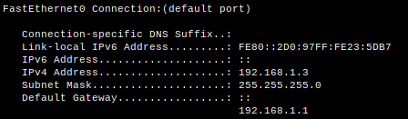
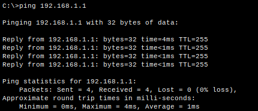
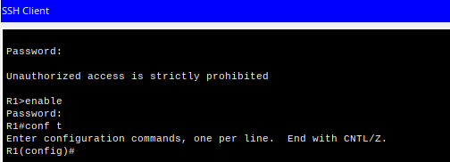
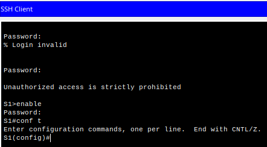
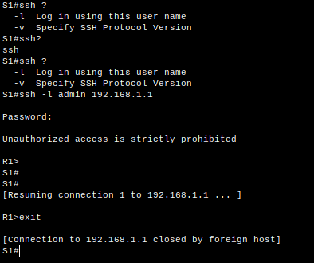

# Доступ к сетевым устройствам по протоколу SSH

## Топология


| Устройство | Интерфейс | IP-адрес     | Маска подсети | Шлюз по умолчанию |
|------------|-----------|--------------|---------------|-------------------|
| R1         | G 0/0/1   | 192.168.1.1  | 255.255.255.0 |                   |
| S1         | VLAN 1    | 192.168.1.11 | 255.255.255.0 | 192.168.1.1       |
| PC-A       | NIC       | 192.168.1.3  | 255.255.255.0 | 192.168.1.1       |

## Часть 1. Настройка основных параметров устройств.

### Настройка маршрутизатора.
```
Router> enable
Router# conf t
Router(config)# no ip domain-lookup
Router(config)# hostname R1
R1(config)# service password-encryption
R1(config)# enable secret class
R1(config)# line console 0
R1(config-line)# logging synchronous
R1(config-line)# password cisco
R1(config-line)# login
R1(config-line)# exit
R1(config)# line vty 0 15
R1(config-line)# logging synchronous
R1(config-line)# password cisco
R1(config-line)# login
R1(config-line)# exit
R1(config)# banner motd "Unauthorized access is strictly prohibited"
R1(config)# interface GigabitEthernet 0/0/1
R1(config-if)# ip 192.168.1.1 255.255.255.0
R1(config-if)# no shutdown
R1(config-if)# end
R1# copy running-config startup-config
```
### Настройка компьютера PC-A
Результаты настройки приведены на рисунке.



### Проверка подключения сети.
Результаты проверки доступности маршрутизатора R1 эхо-запросами приведены на рисунке.



## Часть 2. Настройка маршрутизатора для доступа по протоколу SSH.

### Настройка аутентификации устройств.
```
R1# conf t
R1(config)# hostname R1
R1(config)# ip domain name local
```
### Создание ключа шифрования.
```
R1(config)# crypto key generate rsa
The name for the keys will be: R1.local

Choose the size of the key modulus in the range of 360 to 2048 for your

General Purpose Keys. Choosing a key modulus greater than 512 may take a few minutes.

How many bits in the modulus \[512]: 2048

% Generating 2048 bit RSA keys, keys will be non-exportable...\[OK]
```
### Создание пользователя в локальной базе данных.
```
R1(config)# username admin secret Adm1nP@55
```
### Активация протокола SSH.
```
R1(config)# line vty 0 15
R1(config-line)# login local
R1(config-line)# transport input ssh
R1(config-line)# exit
R1(config)# ip ssh version 2
R1(config)# exit
R1# copy running-config startup-config
```
### Проверка подключения по SSH.
Как видно на рисунке, подключение происходит, пароли запрашиваются.



## Часть 3. Настройка коммутатора для доступа по протоколу SSH.

### Настройка основных параметров коммутатора.
```
Switch> enable
Switch# conf t
Switch(config)# no ip domain-lookup
Switch(config)# hostname R1
Switch(config)# service password-encryption
Switch(config)# enable secret class
Switch(config)# line console 0
Switch(config-line)# logging synchronous
Switch(config-line)# password cisco
Switch(config-line)# login
Switch(config-line)# exit
Switch(config)# line vty 0 4
Switch(config-line)# logging synchronous
Switch(config-line)# password cisco
Switch(config-line)# login
Switch(config-line)# exit
Switch(config)# banner motd "Unauthorized access is strictly prohibited"
Switch(config)# interface vlan 1
Switch(config-if)# ip 192.168.1.11 255.255.255.0
Switch(config-if)# shutdown
Switch(config-if)# no shutdown
Switch(config-if)# end
Switch# copy running-config startup-config
```
### Настройка коммутатора для соединения по протоколу SSH.
```
Switch# conf t
Switch(config)# hostname S1
S1(config)# ip domain name local
S1(config)# crypto key generate rsa
The name for the keys will be: S1.local

Choose the size of the key modulus in the range of 360 to 2048 for your

General Purpose Keys. Choosing a key modulus greater than 512 may take

a few minutes.

How many bits in the modulus \[512]: 2048

% Generating 2048 bit RSA keys, keys will be non-exportable...\[OK]

S1(config)# username admin secret Adm1nP@55
S1(config)# line vty 0 4
S1(config-line)# login local
S1(config-line)# transport input ssh
S1(config-line)# exit
S1(config)# ip ssh version 2
S1(config)# exit
S1# copy running-config startup-config
```
### Проверка соединения с коммутатором по протоколу SSH.
Как видно на рисунке, подключение происходит, пароли запрашиваются.


### Подключение по протоколу SSH к маршрутизатору, используя интерфейс коммандной строки коммутатора.



## Ответы на вопросы.

### Вопрос 1.
Какие версии протокола SSH поддерживаются при использовании интерфейса командной строки?

Это можно определить с помощью команды:
```
ssh –v ?
```
 Коммутатор 2960 под управлением IOS версии 15.0(2) поддерживает SSH v1 и V2.
  
### Вопрос 2.
Как предоставить доступ к сетевому устройству нескольким пользователям, у каждого из которых есть собственное имя пользователя?

Необходимо добавить имя пользователя и пароль каждого пользователя в локальную базу данных с помощью команды username.


