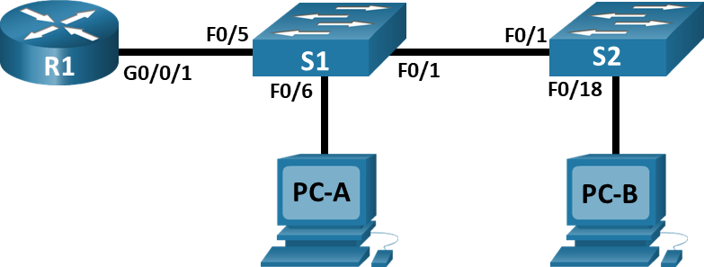
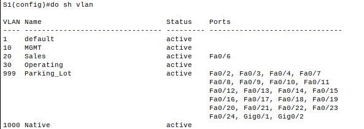
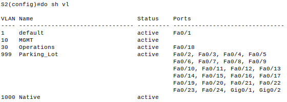
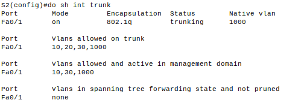
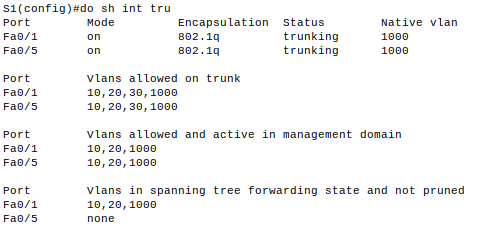
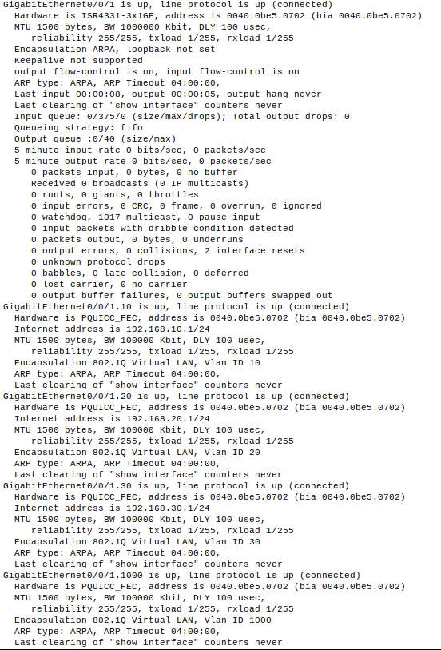
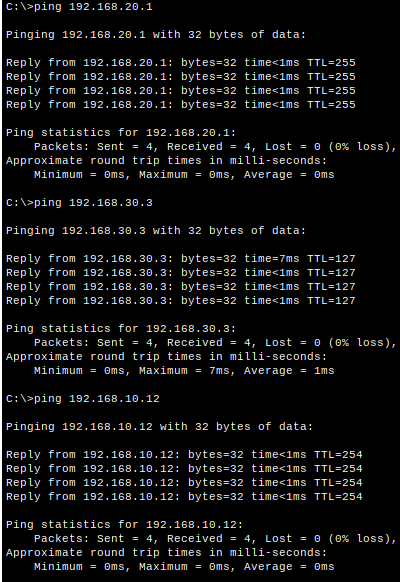
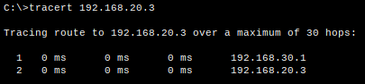

# Внедрение маршрутизации между виртуальными локальными сетями.

## Топология.



## Таблица адресации.

| Устройство | Интерфейс   | IP-адрес      | Маска подсети | Шлюз по умолчанию |
|:----------:|:-----------:|:-------------:|:-------------:|:-----------------:|
| R1         | G0/0/1.10   | 192.168.10.1  | 255.255.255.0 | --                |
|            | G0/0/1.20   | 192.168.20.1  | 255.255.255.0 |                   |
|            | G0/0/1.30   | 192.168.30.1  | 255.255.255.0 |                   |
|            | G0/0/1.1000 | --            | --            |                   |
| S1         | VLAN 10     | 192.168.10.11 | 255.255.255.0 | 192.168.10.1      |
| S2         | VLAN 10     | 192.168.10.12 | 255.255.255.0 | 192.168.10.1      |
| PC-A       | NIC         | 192.168.20.3  | 255.255.255.0 | 192.168.20.1      |
| PC-B       | NIC         | 192.168.30.3  | 255.255.255.0 | 192.168.30.1      |

## Таблица VLAN.
| VLAN | Имя         | Назначенный интерфейс                                          |
|:----:|:-----------:|:--------------------------------------------------------------:|
| 10   | Управление  | S1: VLAN 10 <br> S2: VLAN 10 </br>                             |
| 20   | Sales       | S1: F0/6                                                       |
| 30   | Operations  | S2: F0/18                                                      |
| 999  | Parking_Lot | S1: F0/2-4, F0/7-24, G0/1-2 <br> S2: F0/2-17, F0/19-24, G0/1-2 |
| 1000 | Собственная | --                                                             |

## Часть 1. Создание сети и настройка основных параметров устройства.

### Настройка базовых параметров для маршрутизатора.

```
Router> enable
Router# conf t
Router(config)# no ip domain-lookup
Router(config)# hostname R1
R1(config)# service password-encryption
R1(config)# enable secret class
R1(config)# line console 0
R1(config-line)# logging synchronous
R1(config-line)# password cisco
R1(config-line)# login
R1(config-line)# exit
R1(config)# line vty 0 15
R1(config-line)# logging synchronous
R1(config-line)# password cisco
R1(config-line)# login
R1(config-line)# exit
R1(config)# banner motd "Please login"
R1(config)# clock timezone Moscow 3
R1(config)# exit
R1# copy running-config startup-config
R1# clock set 15:36:00 4 march 2024
```
### Настройка базовых параметров каждого коммутатора.
Настройка коммутатора S1.
```
Switch> enable
Switch# conf t
Switch(config)# no ip domain-lookup
Switch(config)# hostname S1
S1(config)# service password-encryption
S1(config)# enable secret class
S1(config)# line console 0
S1(config-line)# logging synchronous
S1(config-line)# password cisco
S1(config-line)# login
S1(config-line)# exit
S1(config)# line vty 0 15
S1(config-line)# logging synchronous
S1(config-line)# password cisco
S1(config-line)# login
S1(config-line)# exit
S1(config)# banner motd "Please login"
S1(config)# clock timezone Moscow 3
S1(config)# exit
S1# clock set 15:48:00 4 march 2024
S1# copy running-config startup-config
```
Настройка коммутатора S2.
```
Switch> enable
Switch# conf t
Switch(config)# no ip domain-lookup
Switch(config)# hostname S2
S2(config)# service password-encryption
S2(config)# enable secret class
S2(config)# line console 0
S2(config-line)# logging synchronous
S2(config-line)# password cisco
S2(config-line)# login
S2(config-line)# exit
S2(config)# line vty 0 15
S2(config-line)# logging synchronous
S2(config-line)# password cisco
S2(config-line)# login
S2(config-line)# exit
S2(config)# banner motd "Please login"
S2(config)# clock timezone Moscow 3
S2(config)# exit
S2# clock set 15:55:00 4 march 2024
S2# copy running-config startup-config
```
## Часть 2. Создание сетей VLAN и назначение портов коммутатора.
### Создание сети VLAN на коммутаторах и назначение VLAN.
Настройка коммутатора S1.
```
S1(config)# vlan 10
S1(config-vlan)# name MGMT
S1(config-vlan)# exit
S1(config)# interface vlan 10
S1(config-if)# ip address 192.168.10.11 255.255.255.0
S1(config-if)# exit
S1(config)# ip default-gateway 192.168.10.1
S1(config)# vlan 20
S1(config-vlan)# name Sales
S1(config-vlan)# exit
S1(config)# vlan 999
S1(config-vlan)# name Parking_Lot
S1(config-vlan)# exit
S1(config)# vlan 1000
S1(config-vlan)# name Native
S1(config-vlan)# exit
S1(config)# int range fa0/2-4,fa0/7-24,gi0/1-2
S1(config-if)# switchport access vlan 999
S1(config)# interface fa0/6
S1(config-if)# switchport access vlan 20
S1(config-if)# exit
```



Настройка коммутатора S2.
```
S2(config)# vlan 10
S2(config-vlan)# name MGMT
S2(config-vlan)# exit
S2(config)# interface vlan 10
S2(config-if)# ip address 192.168.10.11 255.255.255.0
S2(config-if)# exit
S2(config)# ip default-gateway 192.168.10.1
S2(config)# vlan 30
S2(config-vlan)# name Operations
S2(config-vlan)# exit
S2(config)# vlan 999
S2(config-vlan)# name Parking_Lot
S2(config-vlan)# exit
S2(config)# vlan 1000
S2(config-vlan)# name Native
S2(config-vlan)# exit
S1(config)# int range fa0/2-17,fa0/19-24,gi0/1-2
S1(config-if)# switchport access vlan 999
S2(config)# interface fa0/18
S2(config-if)# switchport access vlan 30
S2(config-if)# exit
```


## Часть 3. Конфигурация магистрального канала стандарта 802.1Q  между коммутаторами.
### Настройка магистрального интерфейса F0/1 на коммутаторах S1 и S2.
```
S1(config)# int fa0/1
S1(config-if)# switchport trunk native vlan 1000
S1(config-if)# switchport trunk allowed vlan 10,20,30,1000
```

```
S2(config)# int fa0/1
S2(config-if)# switchport trunk native vlan 1000
S2(config-if)# switchport trunk allowed vlan 10,20,30,1000
```



### Настройка магистрального интерфейса F0/5 на коммутаторе S1.
```
S2(config)# int fa0/5
S2(config-if)# switchport trunk native vlan 1000
S2(config-if)# switchport trunk allowed vlan 10,20,30,1000
```

### Вопрос.
Что произойдет, если G0/0/1 на R1 будет отключен?

При текущих настройках ничего не изменится. Взаимодействие будет возможно только между коммутаторами.

## Часть 4. Настройка маршрутизации между сетями VLAN.
### Настройка маршрутизатора.
```
R1(config)# int gi0/0/1.10
R1(config-subif)# encapsulation dot1Q 10
R1(config-subif)# ip addr 192.168.10.1 255.255.255.0
R1(config-subif)#description MGMT
R1(config-subif)# exit
R1(config)# int gi0/0/1.20
R1(config-subif)# encapsulation dot1Q 20
R1(config-subif)# ip addr 192.168.20.1 255.255.255.0
R1(config-subif)#description Sales
R1(config-subif)# exit
R1(config)# int gi0/0/1.30
R1(config-subif)# encapsulation dot1Q 30
R1(config-subif)# ip addr 192.168.30.1 255.255.255.0
R1(config-subif)#description Operations
R1(config-subif)# exit
R1(config-subif)# int gi0/0/1.1000
R1(config-subif)# encapsulation dot1Q 1000
R1(config-subif)# description Native
R1(config-subif)# exit
```



## Часть 5. Проверьте, работает ли маршрутизация между VLAN.





В качестве промежуточной точки указан маршрутизатор.