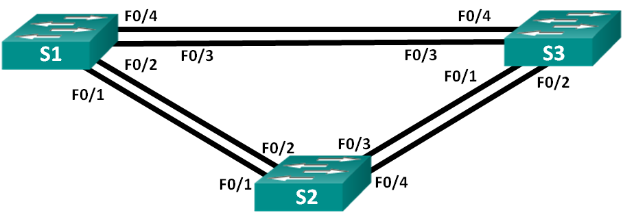
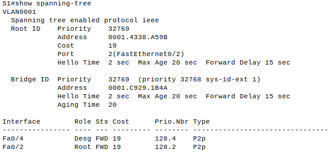
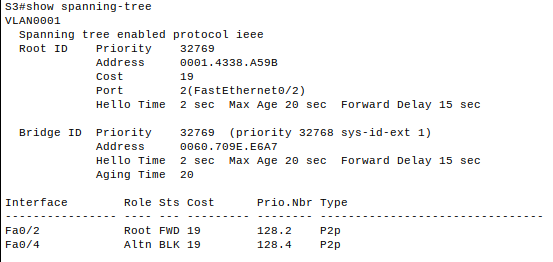
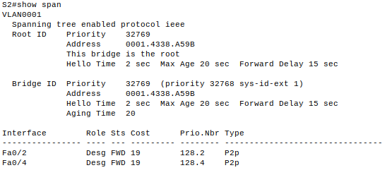
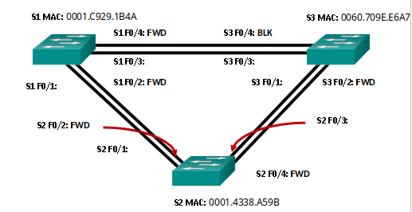
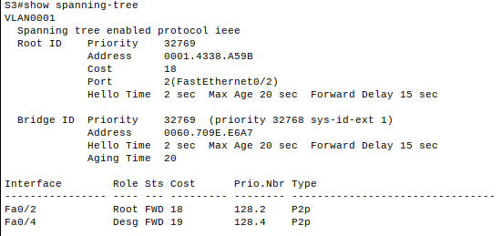
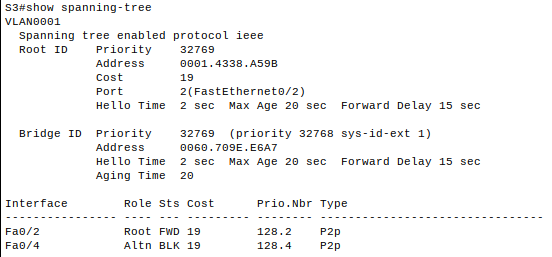
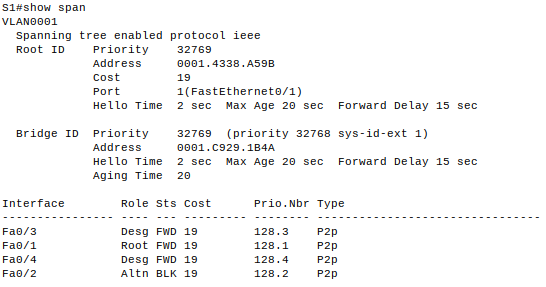
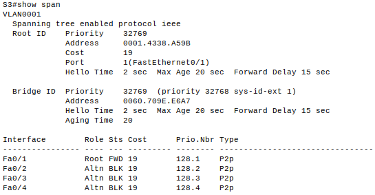

# Развертывание коммутируемой сети с резервными каналами.

## Топология.



##  Таблица адресации.

| Устройство | Интерфейс | IP-адрес    | Маска подсети |
|------------|-----------|-------------|---------------|
| S1         | VLAN 1    | 192.168.1.1 | 255.255.255.0 |
| S2         | VLAN 1    | 192.168.1.2 | 255.255.255.0 |
| S3         | VLAN 1    | 192.168.1.3 | 255.255.255.0 |

## Часть 1. Создание сети и настройка основных параметров.
<details><summary>Настроен коммутатор S1.</summary>
    
```
Switch> enable
Switch# conf t
Switch(config)# no ip domain-lookup
Switch(config)# hostname S1
S1(config)# service password-encryption
S1(config)# enable secret class
S1(config)# line console 0
S1(config-line)# logging synchronous
S1(config-line)# password cisco
S1(config-line)# login
S1(config-line)# exit
S1(config)# line vty 0 4
S1(config-line)# logging synchronous
S1(config-line)# password cisco
S1(config-line)# login
S1(config-line)# exit
S1(config)# interface vlan 1
S1(config-if)# ip addr 192.168.1.1 255.255.255.0
S1(config-if)# no shutdown
S1(config-if)# exit
S1(config)# banner motd "Please login"
S1(config)# exit
S1# copy running-config startup-config
```
</details>
<details><summary>Настроен коммутатор S2.</summary>
    
```
Switch> enable
Switch# conf t
Switch(config)# no ip domain-lookup
Switch(config)# hostname S2
S2(config)# service password-encryption
S2(config)# enable secret class
S2(config)# line console 0
S2(config-line)# logging synchronous
S2(config-line)# password cisco
S2(config-line)# login
S2(config-line)# exit
S2(config)# line vty 0 4
S2(config-line)# logging synchronous
S2(config-line)# password cisco
S2(config-line)# login
S2(config-line)# exit
S2(config)# interface vlan 1
S2(config-if)# ip addr 192.168.1.2 255.255.255.0
S2(config-if)# no shutdown
S2(config-if)# exit
S2(config)# banner motd "Please login"
S2(config)# exit
S2# copy running-config startup-config
```
</details>
<details><summary>Настроен коммутатор S3.</summary>
    
```
Switch> enable
Switch# conf t
Switch(config)# no ip domain-lookup
Switch(config)# hostname S3
S3(config)# service password-encryption
S3(config)# enable secret class
S3(config)# line console 0
S3(config-line)# logging synchronous
S3(config-line)# password cisco
S3(config-line)# login
S3(config-line)# exit
S3(config)# line vty 0 4
S3(config-line)# logging synchronous
S3(config-line)# password cisco
S3(config-line)# login
S3(config-line)# exit
S3(config)# interface vlan 1
S3(config-if)# ip addr 192.168.1.3 255.255.255.0
S3(config-if)# no shutdown
S3(config-if)# exit
S3(config)# banner motd "Please login"
S3(config)# exit
S3# copy running-config startup-config
```
</details>

Эхо-запросы были отправлены в соответствии с заданием, все узлы достижимы.

## Часть 2. Определение корневого моста.

Отключены все порты на коммутаторах. После этого порты FastEthernet 0 - 4 переведены в режим trunk. Порты F0/2 и F0/4 включены на всех коммутаторах.
Выведена информация о протоколе spanning-tree.








### Вопросы.
С учетом выходных данных, поступающих с коммутаторов, ответьте на следующие вопросы.

- Какой коммутатор является корневым мостом?
  Корневым мостом является S2.

- Почему этот коммутатор был выбран протоколом spanning-tree в качестве корневого моста?
Коммутаторы имеют равный приоритет (32769) и равную стоимость (19). Поэтому корневым коммутатором выбирается коммутатор с наименьшим значением MAC-адреса.

- Какие порты на коммутаторе являются корневыми портами?
S1: Fa0/2
S3: Fa0/2
- Какие порты на коммутаторе являются назначенными портами?
  S1: Fa0/4
  S2: Fa0/2, Fa0/4
- Какой порт отображается в качестве альтернативного и в настоящее время заблокирован?
  S3: Fa0/4
- Почему протокол spanning-tree выбрал этот порт в качестве невыделенного (заблокированного) порта?
Был выбран порт на коммутаторе с самым высоким BID.
  
## Часть 3. Наблюдение за процессом выбора протоколом STP порта, исходя из стоимости портов.

```
S3(config)# interface f0/2
S3(config)# spanning-tree vlan 1 cost 18
```
После снижения стоимости порта Fa0/2 на коммутаторе S3.



Как видно, порт Fa0/4 перешел из заблокированного состояния в состояние назначенного.
При удалении стоимости порта:
```
S3(config)# interface f0/2
S3(config)# no spanning-tree vlan 1 cost 18
```

Порт Fa0/4 снова блокируется.




## Часть 4. Наблюдение за процессом выбора порта протоколом STP, исходя из приоритета портов.

Включены порты Fa0/1 и Fa0/3.
Получились следующие результаты:





- Какой порт выбран протоколом STP в качестве порта корневого моста на каждом коммутаторе некорневого моста?
В качестве корневого порта выбраны порты некорневых коммутаторов с наименьшим идентификатором порта.
Fa0/1

- Почему протокол STP выбрал эти порты в качестве портов корневого моста на этих коммутаторах?
В качестве корневого порта выбраны порты некорневых коммутаторов с наименьшим идентификатором порта.

## Вопросы для повторения.

 - Какое значение протокол STP использует первым после выбора корневого моста, чтобы определить выбор порта?
Наименьшая стоимость пути до корневого коммутатора.

- Если первое значение на двух портах одинаково, какое следующее значение будет использовать протокол STP при выборе порта?
Больший приоритет порта.

- Если оба значения на двух портах равны, каким будет следующее значение, которое использует протокол STP при выборе порта?
Наименьший идентификатор порта.
