# Реализация DHCPv4.

## Топология.


## Таблица адресации.
<table>
    <thead>
        <tr>
            <th>Устройство</th>
            <th>Интерфейс</th>
            <th>IP-адрес</th>
            <th>Маска подсети</th>
            <th>Шлюз по умолчанию</th>
        </tr>
    </thead>
    <tbody>
        <tr>
            <td rowspan=5 align="center">R1</td>
            <td align="center">G0/0/0</td>
            <td align="center">10.0.0.1</td>
            <td align="center">255.255.255.252</td>
            <td rowspan=5 align="center">-</td>
        </tr>
        <tr>
            <td align="center">G0/0/1</td>
            <td align="center">-</td>
            <td align="center">-</td>
        </tr>
        <tr>
            <td align="center">G0/0/1.100</td>
            <td align="center">192.168.1.1</td>
            <td align="center">255.255.255.192</td>
        </tr>
        <tr>
            <td align="center">G0/0/1.200</td>
            <td align="center">192.168.1.65</td>
            <td align="center">255.255.255.224</td>
        </tr>
        <tr>
            <td align="center">G0/0/1.1000</td>
            <td align="center">-</td>
            <td align="center">-</td>
        </tr>
        <tr>
            <td rowspan=2 align="center">R2</td>
            <td align="center">G0/0/0</td>
            <td align="center">10.0.0.2</td>
            <td align="center">255.255.255.252</td>
            <td rowspan=2 align="center">-</td>
        </tr>
        <tr>
            <td align="center">G0/0/1</td>
            <td align="center">192.168.1.97</td>
            <td align="center">255.255.255.240</td>
        </tr>
        <tr>
            <td align="center">S1</td>
            <td align="center">VLAN200</td>
            <td align="center">192.168.1.66</td>
            <td align="center">255.255.255.224</td>
            <td align="center">192.168.1.65</td>
        </tr>
        <tr>
            <td align="center">S1</td>
            <td align="center">VLAN1</td>
            <td align="center">192.168.1.98</td>
            <td align="center">255.255.255.240</td>
            <td align="center">192.168.1.97</td>
        </tr>
        <tr>
            <td align="center">PC-A</td>
            <td align="center">NIC</td>
            <td align="center">DHCP</td>
            <td align="center">DHCP</td>
            <td align="center">DHCP</td>
        </tr>
        <tr>
            <td align="center">PC-B</td>
            <td align="center">NIC</td>
            <td align="center">DHCP</td>
            <td align="center">DHCP</td>
            <td align="center">DHCP</td>
        </tr>
    </tbody>
</table>

## Таблица VLAN.
| VLAN | Имя         | Назначенный адрес           |
|------|-------------|-----------------------------|
| 1    | Нет         | S2: F0/18                   |
| 100  | Клиенты     | S1: F0/6                    |
| 200  | Управление  | S1: VLAN 200                |
| 999  | Parking_Lot | S1: F0/1-4, F0/7-24, G0/1-2 |
| 1000 | Собственная | --                          |

## Создание сети и настройка основных параметров устройств.

### Базовая настройка маршрутизаторов.

<details><summary>Настроен маршрутизатор R1.</summary>

```
Router> enable
Router# conf t
Router(config)# no ip domain-lookup
Router(config)# hostname R1
R1(config)# service password-encryption
R1(config)# enable secret class
R1(config)# line console 0
R1(config-line)# logging synchronous
R1(config-line)# password cisco
R1(config-line)# login
R1(config-line)# exit
R1(config)# line vty 0 4
R1(config-line)# logging synchronous
R1(config-line)# password cisco
R1(config-line)# login
R1(config-line)# exit
R1(config)# banner motd "Please login"
R1(config)# clock timezone Moscow 3
R1(config)# exit
R1# copy running-config startup-config
R1# clock set 19:36:00 30 march 2024
```
</details>

<details><summary>Настроен маршрутизатор R2.</summary>

```
Router> enable
Router# conf t
Router(config)# no ip domain-lookup
Router(config)# hostname R2
R2(config)# service password-encryption
R2(config)# enable secret class
R2(config)# line console 0
R2(config-line)# logging synchronous
R2(config-line)# password cisco
R2(config-line)# login
R2(config-line)# exit
R2(config)# line vty 0 4
R2(config-line)# logging synchronous
R2(config-line)# password cisco
R2(config-line)# login
R2(config-line)# exit
R2(config)# banner motd "Please login"
R2(config)# clock timezone Moscow 3
R2(config)# exit
R2# copy running-config startup-config
R2# clock set 19:40:00 30 march 2024
```
</details>

### Настройка маршрутизации между сетями VLAN на маршрутизаторе R1.

Активация интерфейса G0/0/1 и настройка субинтерфейсов.
```
R1(config)# int g0/0/1
R1(config-if)# no shut
R1(config-if)# exit
R1(config)# int gi0/0/1.100
R1(config-subif)# encapsulation dot1Q 100
R1(config-subif)# ip addr 192.168.1.1 255.255.255.192
R1(config-subif)#description Clients
R1(config-subif)# exit
R1(config)# int gi0/0/1.200
R1(config-subif)# encapsulation dot1Q 200
R1(config-subif)# ip addr 192.168.1.65 255.255.255.224
R1(config-subif)#description MGMT
R1(config-subif)# exit
R1(config-subif)# int gi0/0/1.1000
R1(config-subif)# encapsulation dot1Q 1000
R1(config-subif)# description Native
R1(config-subif)# exit
```
Проверка работы вспомогательных интерфейсов:


### Настройка маршрутизатора R2 и статическая маршрутизация между R1 и R2.

Настройка ip-адресов маршрутизатора R2.
```
R2(config)# int g0/0/1
R2(config-if)# ip addr 192.168.1.97 255.255.255.240
R2(config-if)#exit
R2(config)# int g0/0/0
R2(config-if)# ip addr 10.0.0.2 255.255.255.252
R2(config-if)#exit
```

Настройка ip-адреса интерфейса G0/0/0 маршрутизатора R2.
```
R1(config)# int g0/0/0
R1(config-if)# ip addr 10.0.0.1 255.255.255.252
R1(config-if)#exit
```
Настройка статических маршрутов.
R1:
```
R1(config)# ip route 0.0.0.0 0.0.0.0 10.0.0.2
```
R2:
```
R2(config)# ip route 0.0.0.0 0.0.0.0 10.0.0.1
```
Проверка доступности маршрутизатора R2 с R1:


### Настройка базовых параметров коммутаторов.

<details><summary>Настройка коммутатора S1.</summary>
    
```
Switch> enable
Switch# conf t
Switch(config)# no ip domain-lookup
Switch(config)# hostname S1
S1(config)# service password-encryption
S1(config)# enable secret class
S1(config)# line console 0
S1(config-line)# logging synchronous
S1(config-line)# password cisco
S1(config-line)# login
S1(config-line)# exit
S1(config)# line vty 0 4
S1(config-line)# logging synchronous
S1(config-line)# password cisco
S1(config-line)# login
S1(config-line)# exit
S1(config)# banner motd "Please login"
S1(config)# clock timezone Moscow 3
S1(config)# exit
S1# clock set 20:59:00 30 march 2024
S1# copy running-config startup-config
```
</details>

<details><summary>Настройка коммутатора S2.</summary>
    
```
Switch> enable
Switch# conf t
Switch(config)# no ip domain-lookup
Switch(config)# hostname S2
S2(config)# service password-encryption
S2(config)# enable secret class
S2(config)# line console 0
S2(config-line)# logging synchronous
S2(config-line)# password cisco
S2(config-line)# login
S2(config-line)# exit
S2(config)# line vty 0 4
S2(config-line)# logging synchronous
S2(config-line)# password cisco
S2(config-line)# login
S2(config-line)# exit
S2(config)# banner motd "Please login"
S2(config)# clock timezone Moscow 3
S2(config)# exit
S2# clock set 21:03:00 30 march 2024
S2# copy running-config startup-config
```
</details>

### Создание сети VLAN на коммутаторе S1.

Настройка VLAN на коммутаторе S1:
```
S1(config)# vlan 100
S1(config-vlan)# name Clients
S1(config-vlan)# exit
S1(config)# vlan 200
S1(config-vlan)# name MGMT
S1(config-vlan)# exit
S1(config)# interface vlan 200
S1(config-if)# ip address 192.168.1.66 255.255.255.224
S1(config-if)# no shut
S1(config-if)# exit
S1(config)# ip default-gateway 192.168.1.65
S1(config)# vlan 999
S1(config-vlan)# name Parking_Lot
S1(config-vlan)# exit
```
Настройка VLAN на коммутаторе S2:
```
S2(config)# interface vlan 1
S2(config-if)# ip address 192.168.1.98 255.255.255.240
S2(config-if)# no shut
S2(config-if)# exit
S2(config)# ip default-gateway 192.168.1.97
```
Настройка неиспользуемых портов S1:
```
S1(config)# int range f0/1-4, f0/7-24, g0/1-2
S1(config-if-range)# switchport mode access
S1(config-if-range)# switchport access vlan 999
S1(config-if-range)# shut
S1(config-if-range)# exit
```
Настройка неиспользуемых портов S2:
```
S2(config)# int range f0/1-4, f0/6-17, f0/19-24, g0/1-2
S2(config-if-range)# switchport mode access
S2(config-if-range)# shut
S2(config-if-range)# exit
```
Назначение VLAN соответствующим интерфейсам коммутатора.
```
S1(config)# int f0/6
S1(config-if)# switchport mode access
S1(config-if)# switchport access vlan 100
S1(config-if)# exit
```

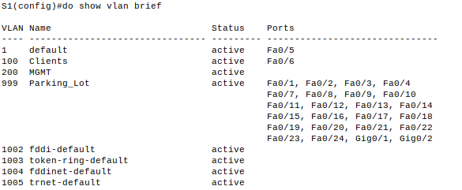

Почему интерфейс F0/5 указан в VLAN 1?
Потому что это VLAN по умолчанию.

### Настройка интерфейса S1 F0/5 в качестве транка 802.1Q.
```
S1(config)# int f0/5
S1(config-if)# switchport mode trunk
S1(config-if)# switchport trunk vlan 1000
S1(config-if)# switchport trunk allowed vlan 100,200,1000
S1(config-if)# end
S1# copy ru st
```

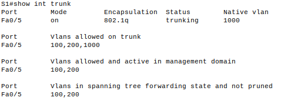

Какой IP-адрес был бы у ПК, если бы он был подключен к сети с помощью DHCP?

ПК назначит адрес APIPA, начинающийся с 169.254. Так как в сети отсутствует DHCP.

## Настройка и проверка двух серверов DHCPv4 на R1.

### Настройка R1 с пулами DHCPv4 для двух поддерживаемых подсетей.
Настройка DHCP для сети 192.168.1.0 255.255.255.192:
```
R1(config)#ip dhcp excluded-address 192.168.1.1 192.168.1.5
R1(config)#ip dhcp pool R1_Client_LAN
R1(dhcp-config)#network 192.168.1.0 255.255.255.192
R1(dhcp-config)#domain-name ccna-lab.com
R1(dhcp-config)#default-router 192.168.1.1
R1(dhcp-config)#lease 2 12 30 //Команда не поддерживается в CPT.
```
Настройка DHCP для сети 192.168.1.96 255.255.255.240:
```
R1(config)#ip dhcp excluded-address 192.168.1.97 192.168.1.101
R1(config)#ip dhcp pool R2_Client_LAN
R1(dhcp-config)#network 192.168.1.96 255.255.255.240
R1(dhcp-config)#default-router 192.168.1.97
R1(dhcp-config)#domain-name ccna-lab.com
R1(dhcp-config)#lease 2 12 30 //Команда не поддерживается в CPT.
R1(dhcp-config)#end
R1# copy ru st
```
Сведения о пуле:

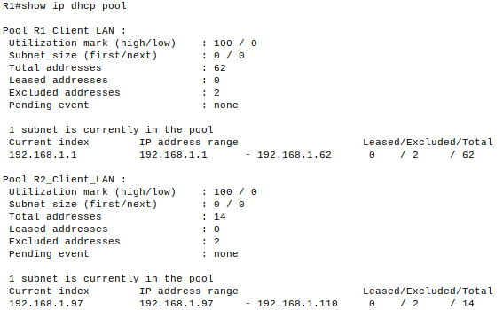

Проверка выданных адресов DHCP:

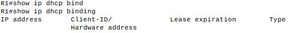

Команда для просмотра сообщений DHCP-сервера "show ip dhcp server statistics" не поддерживается CPT.

Результат получения ip-адреса на PC-A:

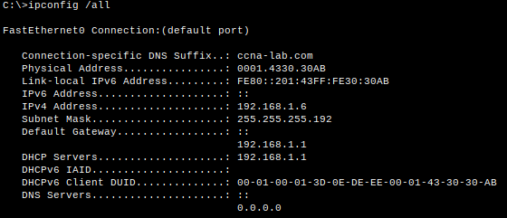

## Настройка и проверка DHCP-ретрансляции на R2.

Настройка R2 в качестве агента DHCP-ретрансляции:
```
R2(config)#int g0/0/1 
R2(config-if)#ip helper-address 10.0.0.1
R2(config-if)#end 
R2#wr
```

Проверка получения ip-адреса компьютером PC-B:

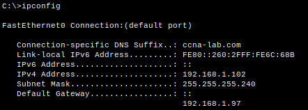

Проверка доступности интерфейса G0/0/1 маршрутизатора R1 с помощью эхо-запросов:

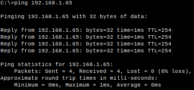

Проверка арендованных адресов на R1:

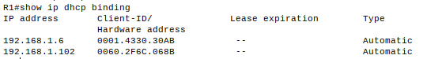

Команда "show ip dhcp server statistics" в CPT недоступна.

# Настройка DHCPv6
## Топология


## Таблица адресации.
<table>
    <thead>
        <tr>
            <th>Устройство</th>
            <th>Интерфейс</th>
            <th>IPv6-адрес</th>
        </tr>
    </thead>
    <tbody>
        <tr>
            <td rowspan=4 align="center">R1</td>
            <td rowspan=2 align="center">G0/0/0</td>
            <td align="center">2001:db8:acad:2::1/64</td>
        </tr>
        <tr>
            <td align="center">fe80::1</td>
        </tr>
        <tr>
            <td rowspan=2 align="center">G0/0/1</td>
            <td align="center">2001:db8:acad:1::1/64</td>
        </tr>
        <tr>
            <td align="center">fe80::1</td>
        </tr>
        <tr>
            <td rowspan=4 align="center">R2</td>
            <td rowspan=2 align="center">G0/0/0</td>
            <td align="center">2001:db8:acad:2::2/64</td>
        </tr>
        <tr>
            <td align="center">fe80::2</td>
        </tr>
        <tr>
            <td rowspan=2 align="center">G0/0/1</td>
            <td align="center">2001:db8:acad:3::1/64</td>
        </tr>
        <tr>
            <td align="center">fe80::1</td>
        </tr>
        <tr>
            <td align="center">PC-A</td>
            <td align="center">NIC</td>
            <td align="center">DHCP</td>
        </tr>
        <tr>
            <td align="center">PC-B</td>
            <td align="center">NIC</td>
            <td align="center">DHCP</td>
        </tr>
    </tbody>
</table>

## Создание сети и настройка основных параметров устройства.

### Базовая настройка маршрутизаторов.

<details><summary>Настроен маршрутизатор R1.</summary>

```
Router> enable
Router# conf t
Router(config)# no ip domain-lookup
Router(config)# hostname R1
R1(config)# service password-encryption
R1(config)# enable secret class
R1(config)# line console 0
R1(config-line)# logging synchronous
R1(config-line)# password cisco
R1(config-line)# login
R1(config-line)# exit
R1(config)# line vty 0 4
R1(config-line)# logging synchronous
R1(config-line)# password cisco
R1(config-line)# login
R1(config-line)# exit
R1(config)# banner motd "Please login"
R1(config)# ipv6 unicast-routing 
R1(config)# exit
R1# wr

```
</details>

<details><summary>Настроен маршрутизатор R2.</summary>

```
Router> enable
Router# conf t
Router(config)# no ip domain-lookup
Router(config)# hostname R2
R2(config)# service password-encryption
R2(config)# enable secret class
R2(config)# line console 0
R2(config-line)# logging synchronous
R2(config-line)# password cisco
R2(config-line)# login
R2(config-line)# exit
R2(config)# line vty 0 4
R2(config-line)# logging synchronous
R2(config-line)# password cisco
R2(config-line)# login
R2(config-line)# exit
R2(config)# banner motd "Please login"
R1(config)# ipv6 unicast-routing 
R2(config)# exit
R2# wr
```
</details>

### Базовая настройка коммутаторов.

<details><summary>Настройка коммутатора S1.</summary>
    
```
Switch> enable
Switch# conf t
Switch(config)# no ip domain-lookup
Switch(config)# hostname S1
S1(config)# service password-encryption
S1(config)# enable secret class
S1(config)# line console 0
S1(config-line)# logging synchronous
S1(config-line)# password cisco
S1(config-line)# login
S1(config-line)# exit
S1(config)# line vty 0 4
S1(config-line)# logging synchronous
S1(config-line)# password cisco
S1(config-line)# login
S1(config-line)# exit
S1(config)# banner motd "Please login"
S1(config)# int ran f0/1-4, f0/7-24, g0/1-2
S1(config-if)# shutdown
S1(config)# exit
S1# wr
```
</details>

<details><summary>Настройка коммутатора S2.</summary>
    
```
Switch> enable
Switch# conf t
Switch(config)# no ip domain-lookup
Switch(config)# hostname S2
S2(config)# service password-encryption
S2(config)# enable secret class
S2(config)# line console 0
S2(config-line)# logging synchronous
S2(config-line)# password cisco
S2(config-line)# login
S2(config-line)# exit
S2(config)# line vty 0 4
S2(config-line)# logging synchronous
S2(config-line)# password cisco
S2(config-line)# login
S2(config-line)# exit
S2(config)# banner motd "Please login"
S1(config)# int ran f0/1-4, f0/6-17, f0/19-24 g0/1-2
S1(config-if)# shutdown
S2(config)# exit
S2# wr
```
</details>

### Настройка интерфейсов и маршрутизации для обоих маршрутизаторов.

Настройка интерфейсов маршрутизатора R1:
```
R1(config)#int g0/0/0
R1(config-if)#ipv6 address 2001:db8:acad:2::1/64
R1(config-if)#ipv6 address fe80::1 link-local 
R1(config-if)#no shut
R1(config-if)#exit
R1(config)#int g0/0/1
R1(config-if)#ipv6 addr 2001:db8:acad:1::1/64
R1(config-if)#ipv6 addr fe80::1 link-local
R1(config-if)#no shut
R1(config-if)#exit
```
Настройка интерфейсов маршрутизатора R2:
```
R2(config)#int g0/0/0
R2(config-if)#ipv6 address 2001:db8:acad:2::2/64
R2(config-if)#ipv6 address fe80::2 link-local 
R2(config-if)#no shut
R2(config-if)#exit
R2(config)#int g0/0/1
R2(config-if)#ipv6 addr 2001:db8:acad:3::1/64
R2(config-if)#ipv6 addr fe80::1 link-local
R2(config-if)#no shut
R2(config-if)#exit
```
Настройка маршрута по умолчанию:
```
R1(config)#ipv6 route ::/0 2001:db8:acad:2::2
R2(config)#ipv6 route ::/0 2001:db8:acad:2::1
```
Проверка работы:

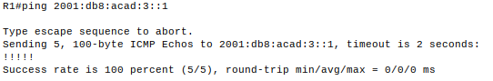

## Проверка назначения адреса SLAAC от R1.

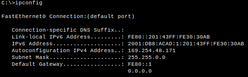

Как видно на рисунке, адрес SLAAC назначен.

## Настройка и проверка сервера DHCP на R1.

Создан пул DHCP IPv6 с именем R1-STATELESS. В составе этого пула назначен адрес DNS-сервера как 2001:db8:acad::254, имя домена - stateless.com
```
R1(config)#ipv6 dhcp pool R1-STATELESS
R1(config-dhcpv6)#dns-server 2001:db8:acad::254
R1(config-dhcpv6)#domain-name STATELESS.com
```
Настроен интерфейс G0/0/1 на R1, чтобы предоставить флаг конфигурации OTHER для локальной сети R1 указан только что созданный пул DHCP в качестве ресурса DHCP для этого интерфейса.
```
R1(config-dhcpv6)#interface g0/0/1
R1(config-if)#ipv6 nd other-config-flag
R1(config-if)#ipv6 dhcp server R1-STATELESS
R1(config-if)#do wr
```
Проверка получения адреса компьютером PC-A:
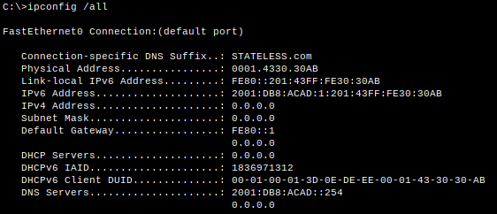

Проверка подключения с помощью эхо-запроса к интерфейсу G0/0/1 R2.

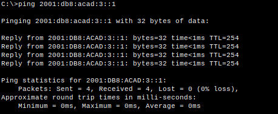

## Настройка сервера DHCPv6 с сохранением состояния на R1.

Создание пула DHCPv6 на R1 для сети 2001:db8:acad:3:aaa::/80. Это предоставит адреса локальной сети, подключенной к интерфейсу G0/0/1 на R2.
```
R1(config)#ipv6 dhcp pool R2-STATEFUL
R1(config-dhcpv6)#address prefix 2001:db8:acad:3:aaa::/80
R1(config-dhcpv6)#dns-server 2001:db8:acad::254
R1(config-dhcpv6)#domain-name STATEFUL.com
```
Назначен только что созданный пул DHCPv6 интерфейсу g0/0/0 на R1.
```
R1(config-dhcpv6)#int g0/0/0
R1(config-if)#ipv6 dhcp
R1(config-if)#ipv6 dhcp s
R1(config-if)#ipv6 dhcp server R2-STATEFUL
```

## Настройка и проверка ретрансляции DHCPv6 на R2.

### Проверка адреса PC-B.

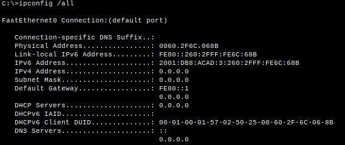

### Настройка R2 в качестве агента DHCP-ретрансляции для локальной сети на G0/0/1.

```
R2(config)#int g0/0/1
R2(config-if)#ipv6 nd managed-config-flag 
R2(config-if)#ipv6 dhcp relay destination 2001:db8:acad:2::1 g0/0/0  //команда не поддерживается в CPT.
R2(config-if)# end
R2#wr
```

### Попытка получить адрес IPv6 из DHCPv6 на PC-B.

Так как в CPT отсутствует команда создающая ретрансяцию для IPv6, PC-B не сможет получить адрес от R1.