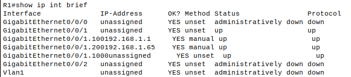
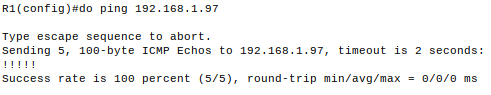

# Реализация DHCPv4.

## Топология.


## Таблица адресации.
| Устройство | Интерфейс   | IP-адрес     | Маска подсети   | Шлюз по умолчанию |
|------------|-------------|--------------|-----------------|-------------------|
| R1         | G0/0/0      | 10.0.0.1     | 255.255.255.252 | --                |
| R1         | G0/0/1      | --           | --              |                   |
|            | G0/0/1.100  | 192.168.1.1  | 255.255.255.192 |                   |
|            | G0/0/1.200  | 192.168.1.65 | 255.255.255.224 |                   |
|            | G0/0/1.1000 | --           | --              |                   |
| R2         | G0/0        | 10.0.0.2     | 255.255.255.252 | --                |
|            | G0/0/1      | 192.168.1.97 | 255.255.255.240 |                   |
| S1         | VLAN 200    | 192.168.1.66 | 255.255.255.224 | 192.168.1.65      |
| S2         | VLAN 1      | 192.168.1.98 | 255.255.255.240 | 192.168.1.97      |
| PC-A       | NIC         | DHCP         | DHCP            | DHCP              |
| PC-B       | NIC         | DHCP         | DHCP            | DHCP              |

__

<table>
    <thead>
        <tr>
            <th>Устройство</th>
            <th>Интерфейс</th>
            <th>IP-адрес</th>
            <th>Маска подсети</th>
            <th>Шлюз по умолчанию</th>
        </tr>
    </thead>
    <tbody>
        <tr>
            <td rowspan=4 align="center">R1 Text</td>
            <td rowspan=2 align="center">R2 Text A</td>
            <td align="center">R3 Text A</td>
        </tr>
        <tr>
            <td align="center">R3 Text B</td>
        </tr>
        <tr>
            <td rowspan=2 align="center">R2 Text B</td>
            <td align="center">R3 Text C</td>
        </tr>
        <tr>
            <td align="center">R3 Text D</td>
        </tr>
    </tbody>
</table>

## Таблица VLAN.
| VLAN | Имя         | Назначенный адрес           |
|------|-------------|-----------------------------|
| 1    | Нет         | S2: F0/18                   |
| 100  | Клиенты     | S1: F0/6                    |
| 200  | Управление  | S1: VLAN 200                |
| 999  | Parking_Lot | S1: F0/1-4, F0/7-24, G0/1-2 |
| 1000 | Собственная | --                          |

## Создание сети и настройка основных параметров устройств.

### Базовая настройка маршрутизаторов.

<details><summary>Настроен маршрутизатор R1.</summary>

```
Router> enable
Router# conf t
Router(config)# no ip domain-lookup
Router(config)# hostname R1
R1(config)# service password-encryption
R1(config)# enable secret class
R1(config)# line console 0
R1(config-line)# logging synchronous
R1(config-line)# password cisco
R1(config-line)# login
R1(config-line)# exit
R1(config)# line vty 0 4
R1(config-line)# logging synchronous
R1(config-line)# password cisco
R1(config-line)# login
R1(config-line)# exit
R1(config)# banner motd "Please login"
R1(config)# clock timezone Moscow 3
R1(config)# exit
R1# copy running-config startup-config
R1# clock set 19:36:00 30 march 2024
```
</details>

<details><summary>Настроен маршрутизатор R2.</summary>

```
Router> enable
Router# conf t
Router(config)# no ip domain-lookup
Router(config)# hostname R2
R2(config)# service password-encryption
R2(config)# enable secret class
R2(config)# line console 0
R2(config-line)# logging synchronous
R2(config-line)# password cisco
R2(config-line)# login
R2(config-line)# exit
R2(config)# line vty 0 4
R2(config-line)# logging synchronous
R2(config-line)# password cisco
R2(config-line)# login
R2(config-line)# exit
R2(config)# banner motd "Please login"
R2(config)# clock timezone Moscow 3
R2(config)# exit
R2# copy running-config startup-config
R2# clock set 19:40:00 30 march 2024
```
</details>

### Настройка маршрутизации между сетями VLAN на маршрутизаторе R1.

Активация интерфейса G0/0/1 и настройка субинтерфейсов.
```
R1(config)# int g0/0/1
R1(config-if)# no shut
R1(config-if)# exit
R1(config)# int gi0/0/1.100
R1(config-subif)# encapsulation dot1Q 100
R1(config-subif)# ip addr 192.168.1.1 255.255.255.192
R1(config-subif)#description Clients
R1(config-subif)# exit
R1(config)# int gi0/0/1.200
R1(config-subif)# encapsulation dot1Q 200
R1(config-subif)# ip addr 192.168.1.65 255.255.255.224
R1(config-subif)#description MGMT
R1(config-subif)# exit
R1(config-subif)# int gi0/0/1.1000
R1(config-subif)# encapsulation dot1Q 1000
R1(config-subif)# description Native
R1(config-subif)# exit
```
Проверка работы вспомогательных интерфейсов:



### Настройка маршрутизатора R2 и статическая маршрутизация между R1 и R2.

Настройка ip-адресов маршрутизатора R2.
```
R2(config)# int g0/0/1
R2(config-if)# ip addr 192.168.1.97 255.255.255.240
R2(config-if)#exit
R2(config)# int g0/0/0
R2(config-if)# ip addr 10.0.0.2 255.255.255.252
R2(config-if)#exit
```

Настройка ip-адреса интерфейса G0/0/0 маршрутизатора R2.
```
R1(config)# int g0/0/0
R1(config-if)# ip addr 10.0.0.1 255.255.255.252
R1(config-if)#exit
```
Настройка статических маршрутов.
R1:
```
R1(config)# ip route 0.0.0.0 0.0.0.0 10.0.0.2
```
R2:
```
R2(config)# ip route 0.0.0.0 0.0.0.0 10.0.0.1
```
Проверка доступности маршрутизатора R2 с R1:



### Настройка базовых параметров коммутаторов.

<details><summary>Настройка коммутатора S1.</summary>
    
```
Switch> enable
Switch# conf t
Switch(config)# no ip domain-lookup
Switch(config)# hostname S1
S1(config)# service password-encryption
S1(config)# enable secret class
S1(config)# line console 0
S1(config-line)# logging synchronous
S1(config-line)# password cisco
S1(config-line)# login
S1(config-line)# exit
S1(config)# line vty 0 4
S1(config-line)# logging synchronous
S1(config-line)# password cisco
S1(config-line)# login
S1(config-line)# exit
S1(config)# banner motd "Please login"
S1(config)# clock timezone Moscow 3
S1(config)# exit
S1# clock set 20:59:00 30 march 2024
S1# copy running-config startup-config
```
</details>

<details><summary>Настройка коммутатора S2.</summary>
    
```
Switch> enable
Switch# conf t
Switch(config)# no ip domain-lookup
Switch(config)# hostname S2
S2(config)# service password-encryption
S2(config)# enable secret class
S2(config)# line console 0
S2(config-line)# logging synchronous
S2(config-line)# password cisco
S2(config-line)# login
S2(config-line)# exit
S2(config)# line vty 0 4
S2(config-line)# logging synchronous
S2(config-line)# password cisco
S2(config-line)# login
S2(config-line)# exit
S2(config)# banner motd "Please login"
S2(config)# clock timezone Moscow 3
S2(config)# exit
S2# clock set 21:03:00 30 march 2024
S2# copy running-config startup-config
```
</details>

### Создание сети VLAN на коммутаторе S1.

Настройка VLAN на коммутаторе S1:
```
S1(config)# vlan 100
S1(config-vlan)# name Clients
S1(config-vlan)# exit
S1(config)# vlan 200
S1(config-vlan)# name MGMT
S1(config-vlan)# exit
S1(config)# interface vlan 200
S1(config-if)# ip address 192.168.1.66 255.255.255.224
S1(config-if)# no shut
S1(config-if)# exit
S1(config)# ip default-gateway 192.168.1.65
S1(config)# vlan 999
S1(config-vlan)# name Parking_Lot
S1(config-vlan)# exit
```
Настройка VLAN на коммутаторе S2:
```
S2(config)# interface vlan 1
S2(config-if)# ip address 192.168.1.98 255.255.255.240
S2(config-if)# no shut
S2(config-if)# exit
S2(config)# ip default-gateway 192.168.1.97
```
Настройка неиспользуемых портов S1:
```
S1(config)# int range f0/1-4, f0/7-24, g0/1-2
S1(config-if-range)# switchport mode access
S1(config-if-range)# switchport access vlan 999
S1(config-if-range)# shut
S1(config-if-range)# exit
```
Настройка неиспользуемых портов S2:
```
S2(config)# int range f0/1-4, f0/6-17, f0/19-24, g0/1-2
S2(config-if-range)# switchport mode access
S2(config-if-range)# shut
S2(config-if-range)# exit
```
