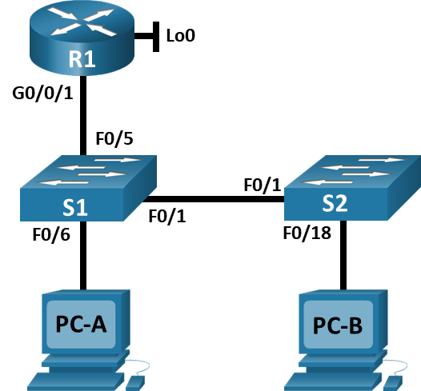
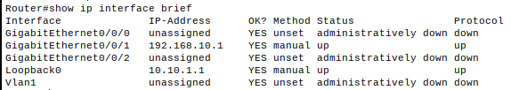
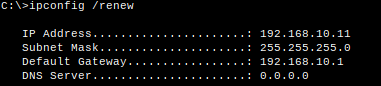
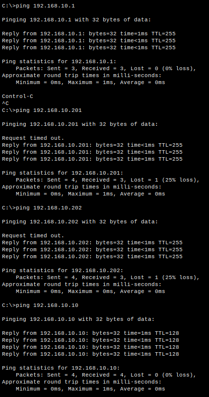

# Конфигурация безопасности коммутатора.

## Топология



## Таблица адресации

<table>
    <thead>
        <tr>
            <th>Устройство</th>
            <th>Интерфейс/VLAN</th>
            <th>IP-адрес</th>
            <th>Маска подсети</th>
        </tr>
    </thead>
    <tbody>
        <tr>
            <td rowspan=2 align="center">R1</td>
            <td align="center">G0/0/1</td>
            <td align="center">192.168.10.1</td>
            <td align="center">255.255.255.0</td>
        </tr>
        <tr>
            <td align="center">Loopback 0</td>
            <td align="center">10.10.1.1</td>
            <td align="center">255.255.255.0</td>
        </tr>
        <tr>
            <td align="center">S1</td>
            <td align="center">VLAN 10</td>
            <td align="center">192.168.10.201</td>
            <td align="center">255.255.255.0</td>
        </tr>
        <tr>
            <td align="center">S2</td>
            <td align="center">VLAN 10</td>
            <td align="center">192.168.10.202</td>
            <td align="center">255.255.255.0</td>
        </tr>
        <tr>
            <td align="center">PC-A</td>
            <td align="center">NIC</td>
            <td align="center">DHCP</td>
            <td align="center">255.255.255.0</td>
        </tr>
        <tr>
            <td align="center">PC-B</td>
            <td align="center">NIC</td>
            <td align="center">DHCP</td>
            <td align="center">255.255.255.0</td>
        </tr>
    </tbody>
</table>

## Настройка основного сетевого устройства.

### Настройте маршрутизатор R1.

Загружен конфигурационный скрипт.
```
enable
configure terminal
hostname R1
no ip domain lookup
ip dhcp excluded-address 192.168.10.1 192.168.10.9
ip dhcp excluded-address 192.168.10.201 192.168.10.202
!
ip dhcp pool Students
 network 192.168.10.0 255.255.255.0
 default-router 192.168.10.1
 domain-name CCNA2.Lab-11.6.1
!
interface Loopback0
 ip address 10.10.1.1 255.255.255.0
!
interface GigabitEthernet0/0/1
 description Link to S1
 ip dhcp relay information trusted
 ip address 192.168.10.1 255.255.255.0
 no shutdown
!
line con 0
 logging synchronous
 exec-timeout 0 0
 ```
Проверка текущей конфигурации.



### Настройка и проверка основных параметров коммутатора.

Настройка коммутатора S1:
```
Switch#conf t
Switch(config)#hostname S1
S1(config)#no ip domain-lookup 
S1(config)#interface f0/1
S1(config-if)#description Link to S2
S1(config-if)#int F0/6
S1(config-if)#description Link to PC-A
S1(config-if)#int f0/5
S1(config-if)#desc Link to R1
S1(config-if)#exit
S1(config)#ip default-gateway 192.168.10.1
```
Настройка коммутатора S2:
```
Switch#conf t
Switch(config)#hostname S2
S2(config)#no ip domain-lookup 
S2(config)#int f0/1
S2(config-if)#desc Link to S1
S2(config-if)#int f0/18
S2(config-if)#desc Link to PC-B
S2(config-if)#exit
S2(config)#ip default-gateway 192.168.10.1
```

## Настройка сетей VLAN на коммутаторах.

Настройки S1:
```
S1#conf t
S1(config)#vlan 10
S1(config-vlan)#name Management
S1(config-vlan)#int vlan 10
S1(config-if)#ip addr 192.168.10.201 255.255.255.0
S1(config-if)#desc SVI
S1(config-if)#no shut
S1(config-if)#exit
S1(config)#vlan 333
S1(config-vlan)#name Native
S1(config-vlan)#exit
S1(config)#vlan 999
S1(config-vlan)#name ParkingLot
```
Настройки S2:
```
S2#conf t
S2(config)#vlan 10
S2(config-vlan)#name Management
S2(config-vlan)#exit
S2(config)#int vlan 10
S2(config-if)#descr SVI
S2(config-if)#ip address 192.168.10.202 255.255.255.0
S2(config-if)#no shut
S2(config-if)#exit
S2(config)#vlan 333
S2(config-vlan)#name Native
S2(config-vlan)#vlan 999
S2(config-vlan)#name ParkingLot
```

## Настройки безопасности коммутатора.
### Релизация магистральных соединений 802.1Q.
Настройка S1:
```
S1(config)# int f0/1
S1(config-if)#sw mode trunk
S1(config-if)#sw trunk native vlan 333

S1(config-if)#do show int trunk
Port        Mode         Encapsulation  Status        Native vlan
Fa0/1       on           802.1q         trunking      333

Port        Vlans allowed on trunk
Fa0/1       1-1005

Port        Vlans allowed and active in management domain
Fa0/1       1,10,333,999

Port        Vlans in spanning tree forwarding state and not pruned
Fa0/1       10,999

S1(config)#int f0/1
S1(config-if)#switchport nonegotiate
S1(config-if)#do show int f0/1 sw | include Negotiation

Negotiation of Trunking: Off
```

Настройка S2:
```
S2(config)#int f0/1
S2(config-if)#sw mode trunk
S2(config-if)#sw trunk native vlan 333

S2(config-if)#do show int trunk
Port        Mode         Encapsulation  Status        Native vlan
Fa0/1       on           802.1q         trunking      333

Port        Vlans allowed on trunk
Fa0/1       1-1005

Port        Vlans allowed and active in management domain
Fa0/1       1,10,333,999

Port        Vlans in spanning tree forwarding state and not pruned
Fa0/1       10,999

S2(config-if)#do show int f0/1 sw | include Negotiation
Negotiation of Trunking: Off
```
### Настройка портов доступа.
Настройка S1:
```
S1(config)#int range f0/5-6
S1(config-if-range)#sw mode access 
S1(config-if-range)#sw access vlan 10
```
Настройка S2:
```
S2(config)#int f0/18
S2(config-if)#sw mode access
S2(config-if)#sw access vlan 10
```

### Безопасность неиспользуемых портов коммутатора.
S1:
```
S1(config)#int range f0/2-4, f0/7-24, g0/1-2
S1(config-if-range)#sw mode access
S1(config-if-range)#sw access vlan 999
S1(config-if-range)#shut
S1(config-if-range)#exit

S1(config)#do show int status
Port      Name               Status       Vlan       Duplex  Speed Type
Fa0/1     Link to S2         connected    trunk      auto    auto  10/100BaseTX
Fa0/2                        disabled 999        auto    auto  10/100BaseTX
Fa0/3                        disabled 999        auto    auto  10/100BaseTX
Fa0/4                        disabled 999        auto    auto  10/100BaseTX
Fa0/5     Link to R1         connected    10         auto    auto  10/100BaseTX
Fa0/6     Link to PC-A       connected    10         auto    auto  10/100BaseTX
Fa0/7                        disabled 999        auto    auto  10/100BaseTX
Fa0/8                        disabled 999        auto    auto  10/100BaseTX
Fa0/9                        disabled 999        auto    auto  10/100BaseTX
Fa0/10                       disabled 999        auto    auto  10/100BaseTX
Fa0/11                       disabled 999        auto    auto  10/100BaseTX
Fa0/12                       disabled 999        auto    auto  10/100BaseTX
Fa0/13                       disabled 999        auto    auto  10/100BaseTX
Fa0/14                       disabled 999        auto    auto  10/100BaseTX
Fa0/15                       disabled 999        auto    auto  10/100BaseTX
Fa0/16                       disabled 999        auto    auto  10/100BaseTX
Fa0/17                       disabled 999        auto    auto  10/100BaseTX
Fa0/18                       disabled 999        auto    auto  10/100BaseTX
Fa0/19                       disabled 999        auto    auto  10/100BaseTX
Fa0/20                       disabled 999        auto    auto  10/100BaseTX
Fa0/21                       disabled 999        auto    auto  10/100BaseTX
Fa0/22                       disabled 999        auto    auto  10/100BaseTX
Fa0/23                       disabled 999        auto    auto  10/100BaseTX
Fa0/24                       disabled 999        auto    auto  10/100BaseTX
Gig0/1                       disabled 999        auto    auto  10/100BaseTX
Gig0/2                       disabled 999        auto    auto  10/100BaseTX
```

S2:
```
S2(config)#int range f0/2-17, f0/19-24, g0/1-2
S2(config-if-range)#sw mode access
S2(config-if-range)#sw access vlan 999
S2(config-if-range)#shutdown 
S2#show int status 
Port      Name               Status       Vlan       Duplex  Speed Type
Fa0/1     Link to S1         connected    trunk      auto    auto  10/100BaseTX
Fa0/2                        disabled 999        auto    auto  10/100BaseTX
Fa0/3                        disabled 999        auto    auto  10/100BaseTX
Fa0/4                        disabled 999        auto    auto  10/100BaseTX
Fa0/5                        disabled 999        auto    auto  10/100BaseTX
Fa0/6                        disabled 999        auto    auto  10/100BaseTX
Fa0/7                        disabled 999        auto    auto  10/100BaseTX
Fa0/8                        disabled 999        auto    auto  10/100BaseTX
Fa0/9                        disabled 999        auto    auto  10/100BaseTX
Fa0/10                       disabled 999        auto    auto  10/100BaseTX
Fa0/11                       disabled 999        auto    auto  10/100BaseTX
Fa0/12                       disabled 999        auto    auto  10/100BaseTX
Fa0/13                       disabled 999        auto    auto  10/100BaseTX
Fa0/14                       disabled 999        auto    auto  10/100BaseTX
Fa0/15                       disabled 999        auto    auto  10/100BaseTX
Fa0/16                       disabled 999        auto    auto  10/100BaseTX
Fa0/17                       disabled 999        auto    auto  10/100BaseTX
Fa0/18    Link to PC-B       connected    10         auto    auto  10/100BaseTX
Fa0/19                       disabled 999        auto    auto  10/100BaseTX
Fa0/20                       disabled 999        auto    auto  10/100BaseTX
Fa0/21                       disabled 999        auto    auto  10/100BaseTX
Fa0/22                       disabled 999        auto    auto  10/100BaseTX
Fa0/23                       disabled 999        auto    auto  10/100BaseTX
Fa0/24                       disabled 999        auto    auto  10/100BaseTX
Gig0/1                       disabled 999        auto    auto  10/100BaseTX
Gig0/2                       disabled 999        auto    auto  10/100BaseTX
```

### Документирование и реализация функций безопасности порта.

<table>
    <thead>
        <tr>
            <th colspan=2>Конфигурация безопасности порта по умолчанию</th>
        </tr>
        <tr>
            <th>Функция</th>
            <th>Настройка по умолчанию</th>
        </tr>
    </thead>
    <tbody>
        <tr>
            <td align="center">Защита портов</td>
            <td align="center">Disabled</td>
        </tr>
        <tr>
            <td align="center">Максимальное количество записей MAC-адресов</td>
            <td align="center">1</td>
        </tr>
        <tr>
            <td align="center">Режим проверки на нарушение безопасности</td>
            <td align="center">Shutdown</td>
        </tr>
        <tr>
            <td align="center">Aging Time</td>
            <td align="center">0 min</td>
        </tr>
        <tr>
            <td align="center">Aging Type</td>
            <td align="center">Absolute</td>
        </tr>
        <tr>
            <td align="center">Secure Static Address Aging</td>
            <td align="center">Disabled</td>
        </tr>
        <tr>
            <td align="center">Sticky MAC Address</td>
            <td align="center">0</td>
        </tr>
    </tbody>
</table>

Включение защиты порта F0/6:
```
S1(config)#int f0/6
S1(config-if)#sw port-security 
S1(config-if)#sw port-security maximum 3
S1(config-if)#sw port-security violation restrict
S1(config-if)#sw port-security aging time 60
S1(config-if)#switchport port-security aging type inactivity //не поддерживается в CPT
```
Проверка настроек порта F0/6:
```
S1#show port-security interface f0/6
Port Security              : Enabled
Port Status                : Secure-up
Violation Mode             : Restrict
Aging Time                 : 60 mins
Aging Type                 : Absolute
SecureStatic Address Aging : Disabled
Maximum MAC Addresses      : 3
Total MAC Addresses        : 0
Configured MAC Addresses   : 0
Sticky MAC Addresses       : 0
Last Source Address:Vlan   : 0000.0000.0000:0
Security Violation Count   : 0

S1#show port-security address 
               Secure Mac Address Table
-----------------------------------------------------------------------------
Vlan    Mac Address       Type                          Ports   Remaining Age
                                                                   (mins)
----    -----------       ----                          -----   -------------
-----------------------------------------------------------------------------
Total Addresses in System (excluding one mac per port)     : 0
Max Addresses limit in System (excluding one mac per port) : 1024
```

Настройка безопасности порта F0/18 на S2:
```
S2(config)#int f0/18
S2(config-if)#sw port-security
S2(config-if)#sw port-security mac-address sticky
S2(config-if)#switchport port-security aging time 60
S2(config-if)#sw port-security maximum 2
S2(config-if)#sw port-security violation protect 
```

Проверка функции безопасности порта F0/18 на S2:
```
S2#show port-security int f0/18
Port Security              : Enabled
Port Status                : Secure-up
Violation Mode             : Protect
Aging Time                 : 60 mins
Aging Type                 : Absolute
SecureStatic Address Aging : Disabled
Maximum MAC Addresses      : 2
Total MAC Addresses        : 0
Configured MAC Addresses   : 0
Sticky MAC Addresses       : 0
Last Source Address:Vlan   : 0000.0000.0000:0
Security Violation Count   : 0

S2#show port-security address 
               Secure Mac Address Table
-----------------------------------------------------------------------------
Vlan    Mac Address       Type                          Ports   Remaining Age
                                                                   (mins)
----    -----------       ----                          -----   -------------
-----------------------------------------------------------------------------
Total Addresses in System (excluding one mac per port)     : 0
Max Addresses limit in System (excluding one mac per port) : 1024
```

### Реализация безопасности DHCP snooping.
Включение DHCP snooping и настройка портов.
```
S2(config)#ip dhcp snooping
S2(config)#ip dhcp snooping vlan 10
S2(config)#interface f0/1
S2(config-if)#ip dhcp snooping trust 
S2(config-if)#int f0/18
S2(config-if)#ip dhcp snooping limit rate 5
S2(config)#no ip dhcp snooping information option //иначе в CPT не работает.
```
Проверка DHCP snooping на S2.
```
S2#show ip dhcp snooping 
Switch DHCP snooping is enabled
DHCP snooping is configured on following VLANs:
10
Insertion of option 82 is enabled
Option 82 on untrusted port is not allowed
Verification of hwaddr field is enabled
Interface                  Trusted    Rate limit (pps)
-----------------------    -------    ----------------
FastEthernet0/1            yes        unlimited       
FastEthernet0/18           no         5     
```
Проверка получения ip-адреса компьютером PC-B.


Проверка привязки отслеживания DHCP:
```
S2#show ip dhcp snooping binding
MacAddress          IpAddress        Lease(sec)  Type           VLAN  Interface
------------------  ---------------  ----------  -------------  ----  -----------------
00:03:E4:E0:89:B3   192.168.10.11    0           dhcp-snooping  10    FastEthernet0/18
Total number of bindings: 1
```

### Реализация PortFast и BPDU Guard.
Настройка PortFast на всех портах доступа, которые используются на обоих коммутаторах.
S1:
```
S1(config)#int range f0/5-6
S1(config-if-range)#spanning-tree portfast 
```
S2:
```
S2(config)#int f0/18
S2(config-if)#spanning-tree portfast 
```
Включение защиты BPDU на портах доступа VLAN 10 S1 и S2.
S1:
```
S1(config)#int f0/6
S1(config-if)#spanning-tree bpduguard enable 
```
S2:
```
S2(config)#int f0/18
S2(config-if)#spanning-tree bpduguard enable 
```

Проверка наличия сквозного подключения с PC-B.


## Вопросы для повторения
1. С точки зрения безопасности порта на S2, почему нет значения таймера для оставшегося возраста в минутах, когда было сконфигурировано динамическое обучение - sticky?

Данный вид обучения не предусматривает устаревание адресов.

2. Что касается безопасности порта на S2, если вы загружаете скрипт текущей конфигурации на S2, почему порту 18 на PC-B никогда не получит IP-адрес через DHCP?

Скрипт загрузит конфигурацию, в которой уже имеется "прилипший" MAC-адрес. Порт сконфигурирован так, что максимальное число MAC-адресов - 2. Таким образом, даже если MAC-адрес PC-B будет другой, то компьютер все равно получит адрес по DHCP.

3. Что касается безопасности порта, в чем разница между типом абсолютного устаревания и типом устаревание по неактивности?

При абсолютном устаревании защищенные адреса удаляются строго через указанный период времени. При устаревании по неактивности удаление происходит после неактивности в течение указанного времени.